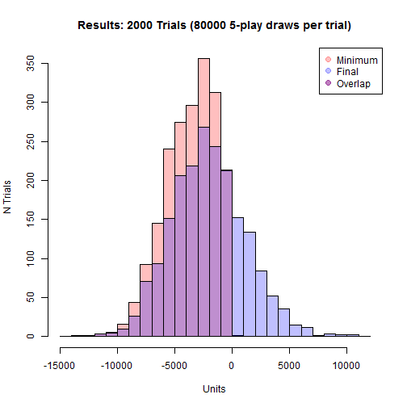
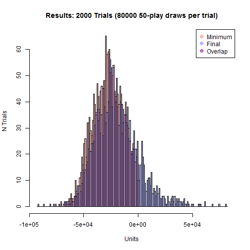
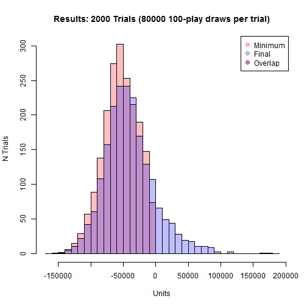
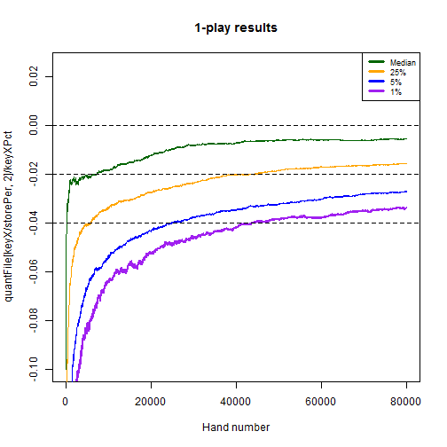
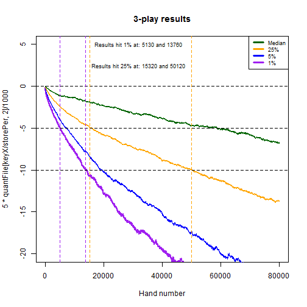
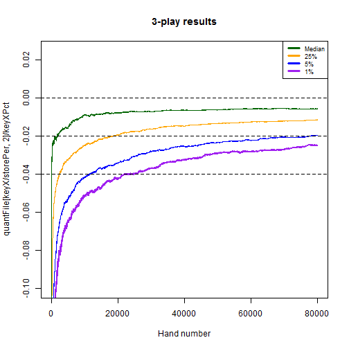

## Overview and Synopsis  
This routine analyzes variability of N-play video poker results based on simulation data made available by the Wizard of Odds <http://wizardofodds.com/games/video-poker/appendix/2/>.  The game simulated was 9/6 Jacks or Better, and this routine looks at the impact of playing 5,000 hands with 1/3/5/10/50/100 lines per hand.  The code broadly copies routines from Exercise002_v003.R, but with the intent of storing figures and summaries.
  
## Data Processing  
###_Coding Routine_  
The Wizard of Odds file was pre-processed in Excel and saved as a CSV once per each of the desired N-play outcomes.  The file is read in, parsed to eliminate any unwanted values, and then assessed based on random draws from uniform(0,1).  Results are stored for the final outcome and the minimum cumulative outcomes.  

Below is the routine for creating the data.  It has been converted to a function so it can be re-run multiple times.  

First, a function is created to read and process files for mapping probabilities to outcomes.  

```r
getBaseOutcomes <- function(myFileName="BaseOutcomes.csv", myDelete=NULL, forceEQ=FALSE) {
    
    if (file.exists(myFileName)) {
        baseOutcomes <- read.csv(myFileName,stringsAsFactors = FALSE)
        if (ncol(baseOutcomes) != 2) { stop("Error in CSV file, should have exactly 2 columns") }
        colnames(baseOutcomes) <- c("probs","outcomes")
    } else {
        baseOutcomes <- data.frame(probs=c(0.01,0.02,0.05,0.18,0.24,0.50),outcomes=c(10,5,2,1,0,-1))
    }
    
    baseOutcomes <- baseOutcomes[baseOutcomes$probs != 0,] ## Can have zeroes as inputs -- ignore those
    
    if ( forceEQ ) {
        pDelta <- sum(baseOutcomes$probs) - 1
        if ( abs(pDelta) < 0.0000001 & 
             abs(pDelta) / baseOutcomes[nrow(baseOutcomes),]$probs < 0.1
            ) 
        {
            print(paste0("Modifying probablities ",paste0(baseOutcomes[nrow(baseOutcomes),],collapse=" ")))
            baseOutcomes[nrow(baseOutcomes),]$probs <- baseOutcomes[nrow(baseOutcomes),]$probs - pDelta
            print(paste0("New probablities ",paste0(baseOutcomes[nrow(baseOutcomes),],collapse=" ")))
        }
    }
    
    if (sum(baseOutcomes$probs)!=1 | min(baseOutcomes$probs) < 0 | 
        sum(is.na(baseOutcomes$probs)) > 0 | sum(is.na(baseOutcomes$outcomes)) > 0) { 
        stop("Please resolve the issue with inputs for probs and outcomes, aborting") 
    }
    
    ## Store the original value read in as outcomes
    baseOutcomes$oldOutcomes <- baseOutcomes$outcomes
    
    ## Null the baseOutcomes$outcomes where outcomes >= X
    if (!is.null(myDelete)) {
        myCond <- parse(text=paste0("baseOutcomes$outcomes",myDelete))
        baseOutcomes$outcomes[eval(myCond)] <- 0
        print(paste0("Converted all cases where ",myCond," to baseOutcomes$outcomes = 0"))
    }
    
    baseMean <- sum(baseOutcomes$probs*baseOutcomes$outcomes)
    baseVar <- sum(baseOutcomes$probs*(baseOutcomes$outcomes-baseMean)^2)
    
    print(paste0("Probabilities sum to 1.  Outcomes has mean ",format(baseMean,digits=3),
                 " and variance ",format(baseVar,digits=3)))

    return(baseOutcomes)
}
```
  
Second, a function is created to draw the random variables and calculate the outcomes database.  

```r
calcOutcomes <- function(baseOutcomes=baseOutcomes,nPlay=1) {
    
    ## Allow nTrials, nPerTrial, and myHurdle to come from global environment
    print(paste0("Running ",nPlay,"-play with nTrials=",nTrials,
                 " nPerTrial=",nPerTrial," and hurdle ",myHurdle
                 )
          )
    
    myCDF <- numeric(nrow(baseOutcomes)+1)
    myCDF[1] <- 0

    for ( intCtr in 1:nrow(baseOutcomes) ) {
        myCDF[intCtr+1] <- myCDF[intCtr] + baseOutcomes$probs[intCtr]
    }

    mtxCumOutcomes <- matrix(baseOutcomes$outcomes[findInterval(matrix(data=runif(nTrials*nPerTrial,0,1),
                                                                       nrow=nPerTrial,
                                                                       ncol=nTrials
                                                                       ),
                                                                myCDF,rightmost.closed=TRUE
                                                                )
                                               ],
                         nrow=nPerTrial,
                         ncol=nTrials
                         )

    print(paste0("Ouctomes across ",nTrials*nPerTrial," draws of ",nPlay,"-play have mean: ",
                 format(mean(mtxCumOutcomes),digits=3)," and variance: ",
                 format(sd(mtxCumOutcomes)^2,digits=3)
                 )
         )

    mtxCumOutcomes <- apply(mtxCumOutcomes,2,FUN=cumsum)  ## About 2.5 seconds for 12,000 x 5,000

    ## Pop this back outside the function for further analysis
    mtxSaver <<- mtxCumOutcomes
    
    maxPerTrial <- apply(mtxCumOutcomes,2,FUN=max)  ## About 1.0 seconds for 12,000 x 5,000
    minPerTrial <- apply(mtxCumOutcomes,2,FUN=min)  ## About 1.0 seconds for 12,000 x 5,000
    lastPerTrial <- as.numeric(mtxCumOutcomes[nrow(mtxCumOutcomes),])
    dfSummary <- data.frame(myTrial = 1:nTrials, myMax = maxPerTrial, myMin = minPerTrial, 
                            myLast = lastPerTrial, myCond = FALSE, myN_Cond = NA, myVal_Cond = NA
                            )
    dfSummary$myCond <- eval(parse(text=paste0("dfSummary$myMin",myHurdle)))
    
    foo <- function(x) { 
        which(eval(parse(text=paste0("x",myHurdle))))[1]
    }
    
    dfSummary$myN_Cond <- apply(mtxCumOutcomes,2,FUN=foo)  ## About 2.5 seconds for 12,000 x 5,000
    
    for ( intCtr in 1:nTrials ) {
        dfSummary$myVal_Cond[intCtr] <- mtxCumOutcomes[dfSummary$myN_Cond[intCtr],dfSummary$myTrial[intCtr]]
    }
    
    return(dfSummary)
}
```

Additionally, a function is created to graph the data and store the outputs.  

```r
graphSummary <- function(graphData, nPlay=1) {
    
    graphData <- graphData[order(-graphData$myCond, graphData$myN_Cond, -graphData$myLast),]
    print(summary(graphData))

    ## Have the x and y units auto-calculated
    minX <- min(graphData$myMin)                  ## Find most negative element
    maxX <- max(0, graphData$myLast)              ## Find most positive element (use 0 if all are negative)
    powX <- log10(max(1, abs(minX), abs(maxX)))   ## Find rough "power" of data

    unitX <- 10^(round(powX-0.5,0)-1)             ## If thousands, use hundreds; if hundreds, use tens; etc.
    minX <- unitX*(floor(minX/unitX)-1)           ## Round to similar units as unitX
    maxX <- unitX*(ceiling(maxX/unitX)+1)         ## Round to similar units as unitX

    hist(graphData$myMin,
         col=rgb(1,0,0,.25),
         main=paste0("Results: ",nTrials," Trials (",nPerTrial," ",
                     nPlay,"-play draws per trial)"
                     ), 
         xlab="Units", ylab="N Trials",
         breaks=seq(minX,maxX,by=unitX),
         xlim=c(minX, maxX)
         )

    hist(graphData$myLast,col=rgb(0,0,1,.25),
         breaks=seq(minX,maxX,by=unitX),
         xlim=c(minX,maxX),
         add=TRUE
         )

    legend("topright",col=c(rgb(1,0,0,.25),rgb(0,0,1,.25),rgb(0.5,0,0.5,.5)),
           legend=c("Minimum","Final","Overlap"),pch=20,pt.cex=2
           )

}
```

###_Prepare the global parameters_  
Finally, the key global parameters are set.  


```r
nTrials <- 2000
nPerTrial <- 50000
myHurdle <- "<=-500"
storePer <- 10
```
  
  
## Results  
The simulation is repeated for each of the desired N-play outcomes.  In this case, we have run the routine for 1/3/5/10/50/100 play.  

Further, we save every 10th hand for 1-play, 3-play, 5-play, and 10-play.
  

###_Results for 1-play_  

```r
## Run for 1-play
baseOutcomes <- getBaseOutcomes(myFileName="Play001Outcomes.csv",forceEQ=TRUE)
```

```
## [1] "Modifying probablities 0.54543467 -1"
## [1] "New probablities 0.54543466 -1"
## [1] "Probabilities sum to 1.  Outcomes has mean -0.00456 and variance 19.5"
```

```r
dfSummary <- calcOutcomes(baseOutcomes=baseOutcomes, nPlay=1)
```

```
## [1] "Running 1-play with nTrials=2000 nPerTrial=50000 and hurdle <=-500"
## [1] "Ouctomes across 1e+08 draws of 1-play have mean: -0.00414 and variance: 19.6"
```

```r
graphSummary(dfSummary, nPlay=1)
```

```
##     myTrial           myMax             myMin             myLast       
##  Min.   :   1.0   Min.   :  -1.00   Min.   :-2646.0   Min.   :-2571.0  
##  1st Qu.: 500.8   1st Qu.:  69.75   1st Qu.:-1165.0   1st Qu.: -914.2  
##  Median :1000.5   Median : 394.00   Median : -762.5   Median : -316.0  
##  Mean   :1000.5   Mean   : 606.49   Mean   : -809.2   Mean   : -207.2  
##  3rd Qu.:1500.2   3rd Qu.: 894.50   3rd Qu.: -396.0   3rd Qu.:  362.2  
##  Max.   :2000.0   Max.   :5004.00   Max.   :   -1.0   Max.   : 4826.0  
##                                                                        
##    myCond           myN_Cond       myVal_Cond  
##  Mode :logical   Min.   : 3718   Min.   :-500  
##  FALSE:641       1st Qu.:11998   1st Qu.:-500  
##  TRUE :1359      Median :16912   Median :-500  
##  NA's :0         Mean   :19852   Mean   :-500  
##                  3rd Qu.:24777   3rd Qu.:-500  
##                  Max.   :49977   Max.   :-500  
##                  NA's   :641     NA's   :641
```


```r
mtxCum001 <- mtxSaver[storePer * (1:(nPerTrial/storePer)),]
```
  
    
###_Results for 3-play_  

```r
## Run for 3-play
baseOutcomes <- getBaseOutcomes(myFileName="Play003Outcomes.csv",forceEQ=TRUE)
```

```
## [1] "Modifying probablities 0.262602735 -3"
## [1] "New probablities 0.26260273 -3"
## [1] "Probabilities sum to 1.  Outcomes has mean -0.0152 and variance 67.7"
```

```r
dfSummary <- calcOutcomes(baseOutcomes=baseOutcomes, nPlay=3)
```

```
## [1] "Running 3-play with nTrials=2000 nPerTrial=50000 and hurdle <=-500"
## [1] "Ouctomes across 1e+08 draws of 3-play have mean: -0.014 and variance: 68.7"
```

```r
graphSummary(dfSummary, nPlay=3)
```

```
##     myTrial           myMax            myMin           myLast       
##  Min.   :   1.0   Min.   :  -3.0   Min.   :-5906   Min.   :-5879.0  
##  1st Qu.: 500.8   1st Qu.: 142.8   1st Qu.:-2547   1st Qu.:-1991.2  
##  Median :1000.5   Median : 757.0   Median :-1662   Median : -862.5  
##  Mean   :1000.5   Mean   :1064.7   Mean   :-1792   Mean   : -701.9  
##  3rd Qu.:1500.2   3rd Qu.:1604.2   3rd Qu.: -903   3rd Qu.:  468.0  
##  Max.   :2000.0   Max.   :7278.0   Max.   :    1   Max.   : 7144.0  
##                                                                     
##    myCond           myN_Cond       myVal_Cond    
##  Mode :logical   Min.   : 1007   Min.   :-502.0  
##  FALSE:253       1st Qu.: 3794   1st Qu.:-501.0  
##  TRUE :1747      Median : 6274   Median :-500.0  
##  NA's :0         Mean   :10347   Mean   :-500.7  
##                  3rd Qu.:12504   3rd Qu.:-500.0  
##                  Max.   :49625   Max.   :-500.0  
##                  NA's   :253     NA's   :253
```


```r
mtxCum003 <- mtxSaver[storePer * (1:(nPerTrial/storePer)),]
```
  
  
###_Results for 5-play_  

```r
## Run for 5-play
baseOutcomes <- getBaseOutcomes(myFileName="Play005Outcomes.csv",forceEQ=TRUE)
```

```
## [1] "Modifying probablities 0.130120405 -5"
## [1] "New probablities 0.130120414 -5"
## [1] "Probabilities sum to 1.  Outcomes has mean -0.0253 and variance 130"
```

```r
dfSummary <- calcOutcomes(baseOutcomes=baseOutcomes, nPlay=5)
```

```
## [1] "Running 5-play with nTrials=2000 nPerTrial=50000 and hurdle <=-500"
## [1] "Ouctomes across 1e+08 draws of 5-play have mean: -0.0243 and variance: 130"
```

```r
graphSummary(dfSummary, nPlay=5)
```

```
##     myTrial           myMax             myMin           myLast       
##  Min.   :   1.0   Min.   :   -5.0   Min.   :-8712   Min.   :-8549.0  
##  1st Qu.: 500.8   1st Qu.:  275.8   1st Qu.:-3634   1st Qu.:-2976.2  
##  Median :1000.5   Median : 1047.0   Median :-2441   Median :-1396.0  
##  Mean   :1000.5   Mean   : 1436.5   Mean   :-2575   Mean   :-1212.7  
##  3rd Qu.:1500.2   3rd Qu.: 2063.5   3rd Qu.:-1265   3rd Qu.:  346.8  
##  Max.   :2000.0   Max.   :12508.0   Max.   :   10   Max.   : 9577.0  
##                                                                      
##    myCond           myN_Cond       myVal_Cond    
##  Mode :logical   Min.   :  487   Min.   :-504.0  
##  FALSE:182       1st Qu.: 2167   1st Qu.:-502.0  
##  TRUE :1818      Median : 3816   Median :-501.0  
##  NA's :0         Mean   : 7883   Mean   :-501.2  
##                  3rd Qu.: 8763   3rd Qu.:-500.0  
##                  Max.   :49961   Max.   :-500.0  
##                  NA's   :182     NA's   :182
```



```r
mtxCum005 <- mtxSaver[storePer * (1:(nPerTrial/storePer)),]
```
  
  
###_Results for 10-play_  

```r
## Run for 10-play
baseOutcomes <- getBaseOutcomes(myFileName="Play010Outcomes.csv",forceEQ=TRUE)
```

```
## [1] "Modifying probablities 0.025913774 -10"
## [1] "New probablities 0.025913775 -10"
## [1] "Probabilities sum to 1.  Outcomes has mean -0.0506 and variance 345"
```

```r
dfSummary <- calcOutcomes(baseOutcomes=baseOutcomes, nPlay=10)
```

```
## [1] "Running 10-play with nTrials=2000 nPerTrial=50000 and hurdle <=-500"
## [1] "Ouctomes across 1e+08 draws of 10-play have mean: -0.0471 and variance: 351"
```

```r
graphSummary(dfSummary, nPlay=10)
```

```
##     myTrial           myMax             myMin            myLast        
##  Min.   :   1.0   Min.   :   -9.0   Min.   :-14109   Min.   :-13573.0  
##  1st Qu.: 500.8   1st Qu.:  452.2   1st Qu.: -6314   1st Qu.: -5310.8  
##  Median :1000.5   Median : 1410.5   Median : -4220   Median : -2593.0  
##  Mean   :1000.5   Mean   : 2214.2   Mean   : -4502   Mean   : -2355.3  
##  3rd Qu.:1500.2   3rd Qu.: 3094.5   3rd Qu.: -2244   3rd Qu.:   275.5  
##  Max.   :2000.0   Max.   :15952.0   Max.   :     4   Max.   : 15307.0  
##                                                                        
##    myCond           myN_Cond       myVal_Cond    
##  Mode :logical   Min.   :  192   Min.   :-509.0  
##  FALSE:99        1st Qu.:  898   1st Qu.:-504.0  
##  TRUE :1901      Median : 1764   Median :-502.0  
##  NA's :0         Mean   : 4943   Mean   :-502.4  
##                  3rd Qu.: 4745   3rd Qu.:-501.0  
##                  Max.   :47971   Max.   :-500.0  
##                  NA's   :99      NA's   :99
```


```r
mtxCum010 <- mtxSaver[storePer * (1:(nPerTrial/storePer)),]
```
  
  
###_Results for 50-play_  

```r
## Run for 50-play
baseOutcomes <- getBaseOutcomes(myFileName="Play050Outcomes.csv",forceEQ=TRUE)
```

```
## [1] "Modifying probablities 2.1776e-05 -50"
## [1] "New probablities 2.1764999999978e-05 -50"
## [1] "Probabilities sum to 1.  Outcomes has mean -0.253 and variance 5139"
```

```r
dfSummary <- calcOutcomes(baseOutcomes=baseOutcomes, nPlay=50)
```

```
## [1] "Running 50-play with nTrials=2000 nPerTrial=50000 and hurdle <=-500"
## [1] "Ouctomes across 1e+08 draws of 50-play have mean: -0.252 and variance: 5299"
```

```r
graphSummary(dfSummary, nPlay=50)
```

```
##     myTrial           myMax           myMin            myLast      
##  Min.   :   1.0   Min.   :  -36   Min.   :-60475   Min.   :-58862  
##  1st Qu.: 500.8   1st Qu.: 1460   1st Qu.:-26466   1st Qu.:-22976  
##  Median :1000.5   Median : 3904   Median :-19034   Median :-14332  
##  Mean   :1000.5   Mean   : 6802   Mean   :-19460   Mean   :-12598  
##  3rd Qu.:1500.2   3rd Qu.: 7844   3rd Qu.:-11310   3rd Qu.: -4568  
##  Max.   :2000.0   Max.   :83855   Max.   :   -64   Max.   : 79337  
##                                                                    
##    myCond           myN_Cond         myVal_Cond    
##  Mode :logical   Min.   :   23.0   Min.   :-541.0  
##  FALSE:9         1st Qu.:   85.0   1st Qu.:-517.0  
##  TRUE :1991      Median :  185.0   Median :-510.0  
##  NA's :0         Mean   : 1166.9   Mean   :-511.5  
##                  3rd Qu.:  593.5   3rd Qu.:-505.0  
##                  Max.   :47942.0   Max.   :-500.0  
##                  NA's   :9         NA's   :9
```


  
  
###_Results for 100-play_  

```r
## Run for 100-play
baseOutcomes <- getBaseOutcomes(myFileName="Play100Outcomes.csv",forceEQ=TRUE)
```

```
## [1] "Modifying probablities 6.3e-08 -99"
## [1] "New probablities 6.48000000379104e-08 -99"
## [1] "Probabilities sum to 1.  Outcomes has mean -0.506 and variance 18791"
```

```r
dfSummary <- calcOutcomes(baseOutcomes=baseOutcomes, nPlay=100)
```

```
## [1] "Running 100-play with nTrials=2000 nPerTrial=50000 and hurdle <=-500"
## [1] "Ouctomes across 1e+08 draws of 100-play have mean: -0.51 and variance: 18620"
```

```r
graphSummary(dfSummary, nPlay=100)
```

```
##     myTrial           myMax            myMin             myLast       
##  Min.   :   1.0   Min.   :   -64   Min.   :-107739   Min.   :-106741  
##  1st Qu.: 500.8   1st Qu.:  2486   1st Qu.: -51245   1st Qu.: -45727  
##  Median :1000.5   Median :  6798   Median : -36054   Median : -27382  
##  Mean   :1000.5   Mean   : 12368   Mean   : -37789   Mean   : -25486  
##  3rd Qu.:1500.2   3rd Qu.: 14129   3rd Qu.: -22940   3rd Qu.: -10466  
##  Max.   :2000.0   Max.   :138950   Max.   :    295   Max.   : 121803  
##                                                                       
##    myCond           myN_Cond         myVal_Cond    
##  Mode :logical   Min.   :   10.0   Min.   :-572.0  
##  FALSE:10        1st Qu.:   28.0   1st Qu.:-535.0  
##  TRUE :1990      Median :   60.0   Median :-521.0  
##  NA's :0         Mean   :  824.2   Mean   :-523.5  
##                  3rd Qu.:  204.5   3rd Qu.:-510.0  
##                  Max.   :49829.0   Max.   :-500.0  
##                  NA's   :10        NA's   :10
```


  
  
###_Plot out cumulative quantiles_  
The cumulative data for 1/3/5/10-play has been stored and can be analyzed.  We prepare a quantiles function and apply it to the respective cumulative outcomes files.  
  

```r
fooFake <- function(x) { quantile(x,c(0.001,0.01,0.05,0.10,0.25,0.50,0.75,0.90,0.95,0.99,1)) }
myQuants001 <- t(apply(mtxCum001, 1, FUN=fooFake))
myQuants003 <- t(apply(mtxCum003, 1, FUN=fooFake))
myQuants005 <- t(apply(mtxCum005, 1, FUN=fooFake))
myQuants010 <- t(apply(mtxCum010, 1, FUN=fooFake))
```
  
  
Next, we generate a function for graphing the cumulative returns of various data:  
  

```r
graphCumulative <- function(quantFile, storePer=1, nPlay, 
                            yLimit=c(-20,5), abLimit=c(0,-4,-8)
                            ) {

    keyX <- seq(storePer, nPerTrial, by=storePer)
    
    plot(x=keyX, y=5 * quantFile[keyX/storePer , 2]/1000, col="purple", 
         type="l", lwd=2, main=paste0(nPlay, "-play results"), 
         xlab="Hand number", ylim=yLimit
         )
    
    lines(x=keyX, y=5*quantFile[keyX/storePer , 3]/1000,col="blue")
    lines(x=keyX, y=5*quantFile[keyX/storePer , 5]/1000,col="orange")
    lines(x=keyX, y=5*quantFile[keyX/storePer , 6]/1000,col="dark green")

    abline(h=abLimit, lty=2)

    abline(v=c(storePer * which(5 * quantFile[,2]/1000 <= abLimit[2])[1], 
               storePer * which(5 * quantFile[,2]/1000 <= abLimit[3])[1]
               ), col="purple", lty=2
           )

    abline(v=c(storePer * which(5 * quantFile[,5]/1000 <= abLimit[2])[1], 
               storePer * which(5 * quantFile[,5]/1000 <= abLimit[3])[1]
               ), col="orange", lty=2
           )

    legend("topright", legend=c("Median","25%","5%","1%"), lwd=3, 
           cex=0.75, col=c("dark green","orange","blue","purple")
           )

    text(x=.4*nPerTrial, y=yLimit[2], 
         paste0("Results hit 1% at: ", 
                storePer * which(5 * quantFile[,2]/1000 <= abLimit[2])[1], 
                " and ", 
                storePer * which(5 * quantFile[,2]/1000 <= abLimit[3])[1]
                ) ,cex=0.75
         )

    text(x=.4*nPerTrial, y=(yLimit[2] + .1 * (yLimit[1] - yLimit[2]) ), 
         paste0("Results hit 25% at: ", 
                storePer * which(5 * quantFile[,5]/1000 <= abLimit[2])[1], 
                " and ", 
                storePer * which(5 * quantFile[,5]/1000 <= abLimit[3])[1]
                ) ,cex=0.75
         )
    
}
```
  
  
And, then we run the function for 1/3/5/10 play.  
  

```r
graphCumulative(quantFile=myQuants001, storePer=storePer, nPlay=1, 
                yLimit=c(-10, 2.5), abLimit=c(0,-2,-4)
                )
```


```r
graphCumulative(quantFile=myQuants003, storePer=storePer, nPlay=3, 
                yLimit=c(-20, 5), abLimit=c(0,-5,-10)
                )
```



```r
graphCumulative(quantFile=myQuants005, storePer=storePer, nPlay=5, 
                yLimit=c(-50, 12.5), abLimit=c(0,-10,-20)
                )
```



```r
graphCumulative(quantFile=myQuants010, storePer=storePer, nPlay=10, 
                yLimit=c(-100, 25), abLimit=c(0,-20,-40)
                )
```



