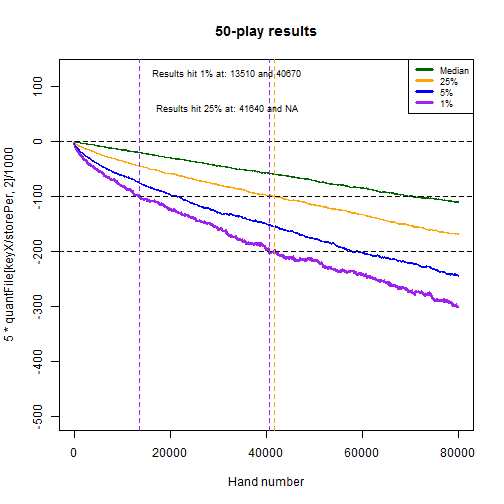

## Overview and Synopsis  
This routine analyzes variability of N-play video poker results based on simulation data made available by the Wizard of Odds <http://wizardofodds.com/games/video-poker/appendix/2/>.  The game simulated was 9/6 Jacks or Better, and this routine looks at the impact of playing 5,000 hands with 1/3/5/10/50/100 lines per hand.  The code broadly copies routines from Exercise002_v003.R, but with the intent of storing figures and summaries.
  
## Data Processing  
###_Coding Routine_  
The Wizard of Odds file was pre-processed in Excel and saved as a CSV once per each of the desired N-play outcomes.  The file is read in, parsed to eliminate any unwanted values, and then assessed based on random draws from uniform(0,1).  Results are stored for the final outcome and the minimum cumulative outcomes.  

Below is the routine for creating the data.  It has been converted to a function so it can be re-run multiple times.  

First, a function is created to read and process files for mapping probabilities to outcomes.  

```r
getBaseOutcomes <- function(myFileName="BaseOutcomes.csv", myDelete=NULL, forceEQ=FALSE) {
    
    if (file.exists(myFileName)) {
        baseOutcomes <- read.csv(myFileName,stringsAsFactors = FALSE)
        if (ncol(baseOutcomes) != 2) { stop("Error in CSV file, should have exactly 2 columns") }
        colnames(baseOutcomes) <- c("probs","outcomes")
    } else {
        baseOutcomes <- data.frame(probs=c(0.01,0.02,0.05,0.18,0.24,0.50),outcomes=c(10,5,2,1,0,-1))
    }
    
    baseOutcomes <- baseOutcomes[baseOutcomes$probs != 0,] ## Can have zeroes as inputs -- ignore those
    
    if ( forceEQ ) {
        pDelta <- sum(baseOutcomes$probs) - 1
        if ( abs(pDelta) < 0.0000001 & 
             abs(pDelta) / baseOutcomes[nrow(baseOutcomes),]$probs < 0.1
            ) 
        {
            print(paste0("Modifying probablities ",paste0(baseOutcomes[nrow(baseOutcomes),],collapse=" ")))
            baseOutcomes[nrow(baseOutcomes),]$probs <- baseOutcomes[nrow(baseOutcomes),]$probs - pDelta
            print(paste0("New probablities ",paste0(baseOutcomes[nrow(baseOutcomes),],collapse=" ")))
        }
    }
    
    if (sum(baseOutcomes$probs)!=1 | min(baseOutcomes$probs) < 0 | 
        sum(is.na(baseOutcomes$probs)) > 0 | sum(is.na(baseOutcomes$outcomes)) > 0) { 
        stop("Please resolve the issue with inputs for probs and outcomes, aborting") 
    }
    
    ## Store the original value read in as outcomes
    baseOutcomes$oldOutcomes <- baseOutcomes$outcomes
    
    ## Null the baseOutcomes$outcomes where outcomes >= X
    if (!is.null(myDelete)) {
        myCond <- parse(text=paste0("baseOutcomes$outcomes",myDelete))
        baseOutcomes$outcomes[eval(myCond)] <- 0
        print(paste0("Converted all cases where ",myCond," to baseOutcomes$outcomes = 0"))
    }
    
    baseMean <- sum(baseOutcomes$probs*baseOutcomes$outcomes)
    baseVar <- sum(baseOutcomes$probs*(baseOutcomes$outcomes-baseMean)^2)
    
    print(paste0("Probabilities sum to 1.  Outcomes has mean ",format(baseMean,digits=3),
                 " and variance ",format(baseVar,digits=3)))

    return(baseOutcomes)
}
```
  
Second, a function is created to draw the random variables and calculate the outcomes database.  

```r
calcOutcomes <- function(baseOutcomes=baseOutcomes,nPlay=1) {
    
    ## Allow nTrials, nPerTrial, and myHurdle to come from global environment
    print(paste0("Running ",nPlay,"-play with nTrials=",nTrials,
                 " nPerTrial=",nPerTrial," and hurdle ",myHurdle
                 )
          )
    
    myCDF <- numeric(nrow(baseOutcomes)+1)
    myCDF[1] <- 0

    for ( intCtr in 1:nrow(baseOutcomes) ) {
        myCDF[intCtr+1] <- myCDF[intCtr] + baseOutcomes$probs[intCtr]
    }

    mtxCumOutcomes <- matrix(baseOutcomes$outcomes[findInterval(matrix(data=runif(nTrials*nPerTrial,0,1),
                                                                       nrow=nPerTrial,
                                                                       ncol=nTrials
                                                                       ),
                                                                myCDF,rightmost.closed=TRUE
                                                                )
                                               ],
                         nrow=nPerTrial,
                         ncol=nTrials
                         )

    print(paste0("Ouctomes across ",nTrials*nPerTrial," draws of ",nPlay,"-play have mean: ",
                 format(mean(mtxCumOutcomes),digits=3)," and variance: ",
                 format(sd(mtxCumOutcomes)^2,digits=3)
                 )
         )

    mtxCumOutcomes <- apply(mtxCumOutcomes,2,FUN=cumsum)  ## About 2.5 seconds for 12,000 x 5,000

    ## Pop this back outside the function for further analysis
    mtxSaver <<- mtxCumOutcomes
    
    maxPerTrial <- apply(mtxCumOutcomes,2,FUN=max)  ## About 1.0 seconds for 12,000 x 5,000
    minPerTrial <- apply(mtxCumOutcomes,2,FUN=min)  ## About 1.0 seconds for 12,000 x 5,000
    lastPerTrial <- as.numeric(mtxCumOutcomes[nrow(mtxCumOutcomes),])
    dfSummary <- data.frame(myTrial = 1:nTrials, myMax = maxPerTrial, myMin = minPerTrial, 
                            myLast = lastPerTrial, myCond = FALSE, myN_Cond = NA, myVal_Cond = NA
                            )
    dfSummary$myCond <- eval(parse(text=paste0("dfSummary$myMin",myHurdle)))
    
    foo <- function(x) { 
        which(eval(parse(text=paste0("x",myHurdle))))[1]
    }
    
    dfSummary$myN_Cond <- apply(mtxCumOutcomes,2,FUN=foo)  ## About 2.5 seconds for 12,000 x 5,000
    
    for ( intCtr in 1:nTrials ) {
        dfSummary$myVal_Cond[intCtr] <- mtxCumOutcomes[dfSummary$myN_Cond[intCtr],dfSummary$myTrial[intCtr]]
    }
    
    return(dfSummary)
}
```

Additionally, a function is created to graph the data and store the outputs.  

```r
graphSummary <- function(graphData, nPlay=1) {
    
    graphData <- graphData[order(-graphData$myCond, graphData$myN_Cond, -graphData$myLast),]
    print(summary(graphData))

    ## Have the x and y units auto-calculated
    minX <- min(graphData$myMin)                  ## Find most negative element
    maxX <- max(0, graphData$myLast)              ## Find most positive element (use 0 if all are negative)
    powX <- log10(max(1, abs(minX), abs(maxX)))   ## Find rough "power" of data

    unitX <- 10^(round(powX-0.5,0)-1)             ## If thousands, use hundreds; if hundreds, use tens; etc.
    minX <- unitX*(floor(minX/unitX)-1)           ## Round to similar units as unitX
    maxX <- unitX*(ceiling(maxX/unitX)+1)         ## Round to similar units as unitX

    hist(graphData$myMin,
         col=rgb(1,0,0,.25),
         main=paste0("Results: ",nTrials," Trials (",nPerTrial," ",
                     nPlay,"-play draws per trial)"
                     ), 
         xlab="Units", ylab="N Trials",
         breaks=seq(minX,maxX,by=unitX),
         xlim=c(minX, maxX)
         )

    hist(graphData$myLast,col=rgb(0,0,1,.25),
         breaks=seq(minX,maxX,by=unitX),
         xlim=c(minX,maxX),
         add=TRUE
         )

    legend("topright",col=c(rgb(1,0,0,.25),rgb(0,0,1,.25),rgb(0.5,0,0.5,.5)),
           legend=c("Minimum","Final","Overlap"),pch=20,pt.cex=2
           )

}
```

###_Prepare the global parameters_  
Finally, the key global parameters are set.  


```r
nTrials <- 1000
nPerTrial <- 80000
myHurdle <- "<=-500"
storePer <- 10
```
  
  
## Results  
The simulation is repeated for each of the desired N-play outcomes.  In this case, we have run the routine for 1/3/5/10/50/100 play.  Further, we save the cumulative results at the end of every 10th hand.  
  

###_Results for 1-play_  

```r
## Run for 1-play
baseOutcomes <- getBaseOutcomes(myFileName="Play001Outcomes.csv",forceEQ=TRUE)
```

```
## [1] "Modifying probablities 0.54543467 -1"
## [1] "New probablities 0.54543466 -1"
## [1] "Probabilities sum to 1.  Outcomes has mean -0.00456 and variance 19.5"
```

```r
dfSummary <- calcOutcomes(baseOutcomes=baseOutcomes, nPlay=1)
```

```
## [1] "Running 1-play with nTrials=1000 nPerTrial=80000 and hurdle <=-500"
## [1] "Ouctomes across 8e+07 draws of 1-play have mean: -0.00437 and variance: 19.5"
```

```r
graphSummary(dfSummary, nPlay=1)
```

```
##     myTrial           myMax             myMin             myLast       
##  Min.   :   1.0   Min.   :  -1.00   Min.   :-3370.0   Min.   :-3345.0  
##  1st Qu.: 250.8   1st Qu.:  86.75   1st Qu.:-1547.0   1st Qu.:-1191.2  
##  Median : 500.5   Median : 485.50   Median :-1023.0   Median : -433.0  
##  Mean   : 500.5   Mean   : 724.40   Mean   :-1100.3   Mean   : -349.5  
##  3rd Qu.: 750.2   3rd Qu.:1084.00   3rd Qu.: -544.5   3rd Qu.:  338.8  
##  Max.   :1000.0   Max.   :6105.00   Max.   :    1.0   Max.   : 6018.0  
##                                                                        
##    myCond           myN_Cond       myVal_Cond  
##  Mode :logical   Min.   : 3919   Min.   :-500  
##  FALSE:226       1st Qu.:12676   1st Qu.:-500  
##  TRUE :774       Median :18574   Median :-500  
##  NA's :0         Mean   :24115   Mean   :-500  
##                  3rd Qu.:31359   3rd Qu.:-500  
##                  Max.   :79045   Max.   :-500  
##                  NA's   :226     NA's   :226
```


```r
mtxCum001 <- mtxSaver[storePer * (1:(nPerTrial/storePer)),]
```
  
    
###_Results for 3-play_  

```r
## Run for 3-play
baseOutcomes <- getBaseOutcomes(myFileName="Play003Outcomes.csv",forceEQ=TRUE)
```

```
## [1] "Modifying probablities 0.262602735 -3"
## [1] "New probablities 0.26260273 -3"
## [1] "Probabilities sum to 1.  Outcomes has mean -0.0152 and variance 67.7"
```

```r
dfSummary <- calcOutcomes(baseOutcomes=baseOutcomes, nPlay=3)
```

```
## [1] "Running 3-play with nTrials=1000 nPerTrial=80000 and hurdle <=-500"
## [1] "Ouctomes across 8e+07 draws of 3-play have mean: -0.0163 and variance: 67.4"
```

```r
graphSummary(dfSummary, nPlay=3)
```

```
##     myTrial           myMax            myMin           myLast       
##  Min.   :   1.0   Min.   :  -3.0   Min.   :-7096   Min.   :-7083.0  
##  1st Qu.: 250.8   1st Qu.: 223.8   1st Qu.:-3552   1st Qu.:-2903.0  
##  Median : 500.5   Median : 867.5   Median :-2378   Median :-1384.0  
##  Mean   : 500.5   Mean   :1246.9   Mean   :-2513   Mean   :-1303.3  
##  3rd Qu.: 750.2   3rd Qu.:1849.2   3rd Qu.:-1333   3rd Qu.:  112.2  
##  Max.   :1000.0   Max.   :7931.0   Max.   :  -15   Max.   : 7640.0  
##                                                                     
##    myCond           myN_Cond       myVal_Cond    
##  Mode :logical   Min.   : 1171   Min.   :-502.0  
##  FALSE:80        1st Qu.: 3945   1st Qu.:-501.0  
##  TRUE :920       Median : 6388   Median :-501.0  
##  NA's :0         Mean   :12822   Mean   :-500.7  
##                  3rd Qu.:14492   3rd Qu.:-500.0  
##                  Max.   :79668   Max.   :-500.0  
##                  NA's   :80      NA's   :80
```


```r
mtxCum003 <- mtxSaver[storePer * (1:(nPerTrial/storePer)),]
```
  
  
###_Results for 5-play_  

```r
## Run for 5-play
baseOutcomes <- getBaseOutcomes(myFileName="Play005Outcomes.csv",forceEQ=TRUE)
```

```
## [1] "Modifying probablities 0.130120405 -5"
## [1] "New probablities 0.130120414 -5"
## [1] "Probabilities sum to 1.  Outcomes has mean -0.0253 and variance 130"
```

```r
dfSummary <- calcOutcomes(baseOutcomes=baseOutcomes, nPlay=5)
```

```
## [1] "Running 5-play with nTrials=1000 nPerTrial=80000 and hurdle <=-500"
## [1] "Ouctomes across 8e+07 draws of 5-play have mean: -0.0267 and variance: 127"
```

```r
graphSummary(dfSummary, nPlay=5)
```

```
##     myTrial           myMax             myMin            myLast       
##  Min.   :   1.0   Min.   :   -5.0   Min.   :-10626   Min.   :-9322.0  
##  1st Qu.: 250.8   1st Qu.:  275.5   1st Qu.: -5144   1st Qu.:-4235.0  
##  Median : 500.5   Median : 1052.0   Median : -3514   Median :-2282.5  
##  Mean   : 500.5   Mean   : 1551.3   Mean   : -3690   Mean   :-2137.2  
##  3rd Qu.: 750.2   3rd Qu.: 2234.5   3rd Qu.: -2063   3rd Qu.: -161.5  
##  Max.   :1000.0   Max.   :11552.0   Max.   :     4   Max.   : 7323.0  
##                                                                       
##    myCond           myN_Cond       myVal_Cond    
##  Mode :logical   Min.   :  490   Min.   :-504.0  
##  FALSE:45        1st Qu.: 1990   1st Qu.:-502.0  
##  TRUE :955       Median : 3861   Median :-501.0  
##  NA's :0         Mean   : 9783   Mean   :-501.2  
##                  3rd Qu.: 9837   3rd Qu.:-500.0  
##                  Max.   :78355   Max.   :-500.0  
##                  NA's   :45      NA's   :45
```


```r
mtxCum005 <- mtxSaver[storePer * (1:(nPerTrial/storePer)),]
```
  
  
###_Results for 10-play_  

```r
## Run for 10-play
baseOutcomes <- getBaseOutcomes(myFileName="Play010Outcomes.csv",forceEQ=TRUE)
```

```
## [1] "Modifying probablities 0.025913774 -10"
## [1] "New probablities 0.025913775 -10"
## [1] "Probabilities sum to 1.  Outcomes has mean -0.0506 and variance 345"
```

```r
dfSummary <- calcOutcomes(baseOutcomes=baseOutcomes, nPlay=10)
```

```
## [1] "Running 10-play with nTrials=1000 nPerTrial=80000 and hurdle <=-500"
## [1] "Ouctomes across 8e+07 draws of 10-play have mean: -0.0547 and variance: 328"
```

```r
graphSummary(dfSummary, nPlay=10)
```

```
##     myTrial           myMax             myMin            myLast      
##  Min.   :   1.0   Min.   :   -9.0   Min.   :-20893   Min.   :-20655  
##  1st Qu.: 250.8   1st Qu.:  364.8   1st Qu.: -9051   1st Qu.: -7948  
##  Median : 500.5   Median : 1404.0   Median : -6280   Median : -4612  
##  Mean   : 500.5   Mean   : 2240.4   Mean   : -6587   Mean   : -4375  
##  3rd Qu.: 750.2   3rd Qu.: 3293.8   3rd Qu.: -3764   3rd Qu.: -1318  
##  Max.   :1000.0   Max.   :22979.0   Max.   :    -4   Max.   : 22149  
##                                                                      
##    myCond           myN_Cond       myVal_Cond    
##  Mode :logical   Min.   :  224   Min.   :-509.0  
##  FALSE:24        1st Qu.:  907   1st Qu.:-504.0  
##  TRUE :976       Median : 1754   Median :-502.0  
##  NA's :0         Mean   : 5656   Mean   :-502.5  
##                  3rd Qu.: 4950   3rd Qu.:-501.0  
##                  Max.   :78332   Max.   :-500.0  
##                  NA's   :24      NA's   :24
```


```r
mtxCum010 <- mtxSaver[storePer * (1:(nPerTrial/storePer)),]
```
  
  
###_Results for 50-play_  

```r
## Run for 50-play
baseOutcomes <- getBaseOutcomes(myFileName="Play050Outcomes.csv",forceEQ=TRUE)
```

```
## [1] "Modifying probablities 2.1776e-05 -50"
## [1] "New probablities 2.1764999999978e-05 -50"
## [1] "Probabilities sum to 1.  Outcomes has mean -0.253 and variance 5139"
```

```r
dfSummary <- calcOutcomes(baseOutcomes=baseOutcomes, nPlay=50)
```

```
## [1] "Running 50-play with nTrials=1000 nPerTrial=80000 and hurdle <=-500"
## [1] "Ouctomes across 8e+07 draws of 50-play have mean: -0.252 and variance: 5229"
```

```r
graphSummary(dfSummary, nPlay=50)
```

```
##     myTrial           myMax           myMin            myLast      
##  Min.   :   1.0   Min.   :  -36   Min.   :-75518   Min.   :-75439  
##  1st Qu.: 250.8   1st Qu.: 1369   1st Qu.:-38104   1st Qu.:-34245  
##  Median : 500.5   Median : 3972   Median :-27670   Median :-22739  
##  Mean   : 500.5   Mean   : 7795   Mean   :-28385   Mean   :-20181  
##  3rd Qu.: 750.2   3rd Qu.: 9021   3rd Qu.:-17826   3rd Qu.: -9372  
##  Max.   :1000.0   Max.   :86429   Max.   :  -136   Max.   : 64305  
##                                                                    
##    myCond           myN_Cond          myVal_Cond    
##  Mode :logical   Min.   :   20.00   Min.   :-541.0  
##  FALSE:2         1st Qu.:   83.25   1st Qu.:-517.0  
##  TRUE :998       Median :  183.00   Median :-509.0  
##  NA's :0         Mean   : 1314.60   Mean   :-511.2  
##                  3rd Qu.:  622.00   3rd Qu.:-505.0  
##                  Max.   :78925.00   Max.   :-500.0  
##                  NA's   :2          NA's   :2
```


```r
mtxCum050 <- mtxSaver[storePer * (1:(nPerTrial/storePer)),]
```
  
  
###_Results for 100-play_  

```r
## Run for 100-play
baseOutcomes <- getBaseOutcomes(myFileName="Play100Outcomes.csv",forceEQ=TRUE)
```

```
## [1] "Modifying probablities 6.3e-08 -99"
## [1] "New probablities 6.48000000379104e-08 -99"
## [1] "Probabilities sum to 1.  Outcomes has mean -0.506 and variance 18791"
```

```r
dfSummary <- calcOutcomes(baseOutcomes=baseOutcomes, nPlay=100)
```

```
## [1] "Running 100-play with nTrials=1000 nPerTrial=80000 and hurdle <=-500"
## [1] "Ouctomes across 8e+07 draws of 100-play have mean: -0.516 and variance: 18935"
```

```r
graphSummary(dfSummary, nPlay=100)
```

```
##     myTrial           myMax            myMin             myLast       
##  Min.   :   1.0   Min.   :   -66   Min.   :-143416   Min.   :-140509  
##  1st Qu.: 250.8   1st Qu.:  2829   1st Qu.: -73374   1st Qu.: -67180  
##  Median : 500.5   Median :  7214   Median : -53547   Median : -44687  
##  Mean   : 500.5   Mean   : 14189   Mean   : -55680   Mean   : -41292  
##  3rd Qu.: 750.2   3rd Qu.: 15369   3rd Qu.: -37283   3rd Qu.: -21843  
##  Max.   :1000.0   Max.   :164317   Max.   :   -572   Max.   : 158507  
##   myCond           myN_Cond         myVal_Cond    
##  Mode:logical   Min.   :    9.0   Min.   :-570.0  
##  TRUE:1000      1st Qu.:   28.0   1st Qu.:-535.0  
##  NA's:0         Median :   61.0   Median :-520.0  
##                 Mean   :  585.3   Mean   :-522.8  
##                 3rd Qu.:  217.8   3rd Qu.:-509.0  
##                 Max.   :64545.0   Max.   :-500.0
```


```r
mtxCum100 <- mtxSaver[storePer * (1:(nPerTrial/storePer)),]
```
  
  
###_Plot out cumulative quantiles_  
The cumulative data has been stored and can be analyzed.  We prepare a quantiles function and apply it to the respective cumulative outcomes files.  
  

```r
fooFake <- function(x) { quantile(x,c(0.001,0.01,0.05,0.10,0.25,0.50,0.75,0.90,0.95,0.99,1)) }
myQuants001 <- t(apply(mtxCum001, 1, FUN=fooFake))
myQuants003 <- t(apply(mtxCum003, 1, FUN=fooFake))
myQuants005 <- t(apply(mtxCum005, 1, FUN=fooFake))
myQuants010 <- t(apply(mtxCum010, 1, FUN=fooFake))
myQuants050 <- t(apply(mtxCum050, 1, FUN=fooFake))
myQuants100 <- t(apply(mtxCum100, 1, FUN=fooFake))
```
  
  
Next, we generate a function for graphing the cumulative returns of various data:  
  

```r
graphCumulative <- function(quantFile, storePer=1, nPlay, 
                            yLimit=c(-20,5), abLimit=c(0,-4,-8)
                            ) {

    keyX <- seq(storePer, nPerTrial, by=storePer)
    
    ## Plot #1 is quantiles for cumulative returns (in units) by hand
    plot(x=keyX, y=5 * quantFile[keyX/storePer , 2]/1000, col="purple", 
         type="l", lwd=2, main=paste0(nPlay, "-play results"), 
         xlab="Hand number", ylim=yLimit
         )
    
    lines(x=keyX, y=5*quantFile[keyX/storePer , 3]/1000,col="blue")
    lines(x=keyX, y=5*quantFile[keyX/storePer , 5]/1000,col="orange")
    lines(x=keyX, y=5*quantFile[keyX/storePer , 6]/1000,col="dark green")

    abline(h=abLimit, lty=2)

    abline(v=c(storePer * which(5 * quantFile[,2]/1000 <= abLimit[2])[1], 
               storePer * which(5 * quantFile[,2]/1000 <= abLimit[3])[1]
               ), col="purple", lty=2
           )

    abline(v=c(storePer * which(5 * quantFile[,5]/1000 <= abLimit[2])[1], 
               storePer * which(5 * quantFile[,5]/1000 <= abLimit[3])[1]
               ), col="orange", lty=2
           )

    legend("topright", legend=c("Median","25%","5%","1%"), lwd=3, 
           cex=0.75, col=c("dark green","orange","blue","purple")
           )

    text(x=.4*nPerTrial, y=yLimit[2], 
         paste0("Results hit 1% at: ", 
                storePer * which(5 * quantFile[,2]/1000 <= abLimit[2])[1], 
                " and ", 
                storePer * which(5 * quantFile[,2]/1000 <= abLimit[3])[1]
                ) ,cex=0.75
         )

    text(x=.4*nPerTrial, y=(yLimit[2] + .1 * (yLimit[1] - yLimit[2]) ), 
         paste0("Results hit 25% at: ", 
                storePer * which(5 * quantFile[,5]/1000 <= abLimit[2])[1], 
                " and ", 
                storePer * which(5 * quantFile[,5]/1000 <= abLimit[3])[1]
                ) ,cex=0.75
         )
    
    
    ## Plot #2 is quantiles for cumulative returns (in percentage) by # base hands
    keyXPct <- keyX * nPlay
    
    plot(x=keyX, y=quantFile[keyX/storePer , 2] / keyXPct, col="purple", 
         type="l", lwd=2, main=paste0(nPlay, "-play results"), 
         xlab="Hand number", ylim=c(-0.1,0.025)
         )
    
    lines(x=keyX, y=quantFile[keyX/storePer , 3]/keyXPct,col="blue")
    lines(x=keyX, y=quantFile[keyX/storePer , 5]/keyXPct,col="orange")
    lines(x=keyX, y=quantFile[keyX/storePer , 6]/keyXPct,col="dark green")
    
    legend("topright", legend=c("Median","25%","5%","1%"), lwd=3, 
           cex=0.75, col=c("dark green","orange","blue","purple")
           )
    
    abline(h=c(0,-0.02,-0.04), lty=2)
}
```
  
  
And, then we run the function for 1/3/5/10/50/100 play.  
  

```r
graphCumulative(quantFile=myQuants001, storePer=storePer, nPlay=1, 
                yLimit=c(-10, 2.5), abLimit=c(0,-2,-4)
                )
```


```r
graphCumulative(quantFile=myQuants003, storePer=storePer, nPlay=3, 
                yLimit=c(-20, 5), abLimit=c(0,-5,-10)
                )
```


```r
graphCumulative(quantFile=myQuants005, storePer=storePer, nPlay=5, 
                yLimit=c(-50, 12.5), abLimit=c(0,-10,-20)
                )
```


```r
graphCumulative(quantFile=myQuants010, storePer=storePer, nPlay=10, 
                yLimit=c(-100, 25), abLimit=c(0,-20,-40)
                )
```


```r
graphCumulative(quantFile=myQuants050, storePer=storePer, nPlay=50, 
                yLimit=c(-500, 125), abLimit=c(0,-100,-200)
                )
```



```r
graphCumulative(quantFile=myQuants100, storePer=storePer, nPlay=100, 
                yLimit=c(-1000, 250), abLimit=c(0,-200,-400)
                )
```


  
  
## Additional Comparisons  
