## Overview and Synopsis  
This routine analyzes variability of N-play video poker results based on simulation data made available by the Wizard of Odds <http://wizardofodds.com/games/video-poker/appendix/2/>.  The game simulated was 9/6 Jacks or Better, and this routine looks at the impact of playing 5,000 hands with 1/3/5/10/50/100 lines per hand.  The code broadly copies routines from Exercise002_v003.R, but with the intent of storing figures and summaries.
  
## Data Processing  
###_Coding Routine_  
The Wizard of Odds file was pre-processed in Excel and saved as a CSV once per each of the desired N-play outcomes.  The file is read in, parsed to eliminate any unwanted values, and then assessed based on random draws from uniform(0,1).  Results are stored for the final outcome and the minimum cumulative outcomes.  

Below is the routine for creating the data.  It has been converted to a function so it can be re-run multiple times.  

First, a function is created to read and process files for mapping probabilities to outcomes.  

```r
getBaseOutcomes <- function(myFileName="BaseOutcomes.csv", myDelete=NULL, forceEQ=FALSE) {
    
    if (file.exists(myFileName)) {
        baseOutcomes <- read.csv(myFileName,stringsAsFactors = FALSE)
        if (ncol(baseOutcomes) != 2) { stop("Error in CSV file, should have exactly 2 columns") }
        colnames(baseOutcomes) <- c("probs","outcomes")
    } else {
        baseOutcomes <- data.frame(probs=c(0.01,0.02,0.05,0.18,0.24,0.50),outcomes=c(10,5,2,1,0,-1))
    }
    
    baseOutcomes <- baseOutcomes[baseOutcomes$probs != 0,] ## Can have zeroes as inputs -- ignore those
    
    if ( forceEQ ) {
        pDelta <- sum(baseOutcomes$probs) - 1
        if ( abs(pDelta) < 0.0000001 & 
             abs(pDelta) / baseOutcomes[nrow(baseOutcomes),]$probs < 0.1
            ) 
        {
            print(paste0("Modifying probablities ",paste0(baseOutcomes[nrow(baseOutcomes),],collapse=" ")))
            baseOutcomes[nrow(baseOutcomes),]$probs <- baseOutcomes[nrow(baseOutcomes),]$probs - pDelta
            print(paste0("New probablities ",paste0(baseOutcomes[nrow(baseOutcomes),],collapse=" ")))
        }
    }
    
    if (sum(baseOutcomes$probs)!=1 | min(baseOutcomes$probs) < 0 | 
        sum(is.na(baseOutcomes$probs)) > 0 | sum(is.na(baseOutcomes$outcomes)) > 0) { 
        stop("Please resolve the issue with inputs for probs and outcomes, aborting") 
    }
    
    ## Store the original value read in as outcomes
    baseOutcomes$oldOutcomes <- baseOutcomes$outcomes
    
    ## Null the baseOutcomes$outcomes where outcomes >= X
    if (!is.null(myDelete)) {
        myCond <- parse(text=paste0("baseOutcomes$outcomes",myDelete))
        baseOutcomes$outcomes[eval(myCond)] <- 0
        print(paste0("Converted all cases where ",myCond," to baseOutcomes$outcomes = 0"))
    }
    
    baseMean <- sum(baseOutcomes$probs*baseOutcomes$outcomes)
    baseVar <- sum(baseOutcomes$probs*(baseOutcomes$outcomes-baseMean)^2)
    
    print(paste0("Probabilities sum to 1.  Outcomes has mean ",format(baseMean,digits=3),
                 " and variance ",format(baseVar,digits=3)))

    return(baseOutcomes)
}
```
  
Second, a function is created to draw the random variables and calculate the outcomes database.  

```r
calcOutcomes <- function(baseOutcomes=baseOutcomes,nPlay=1) {
    
    ## Allow nTrials, nPerTrial, and myHurdle to come from global environment
    print(paste0("Running ",nPlay,"-play with nTrials=",nTrials,
                 " nPerTrial=",nPerTrial," and hurdle ",myHurdle
                 )
          )
    
    myCDF <- numeric(nrow(baseOutcomes)+1)
    myCDF[1] <- 0

    for ( intCtr in 1:nrow(baseOutcomes) ) {
        myCDF[intCtr+1] <- myCDF[intCtr] + baseOutcomes$probs[intCtr]
    }

    mtxCumOutcomes <- matrix(baseOutcomes$outcomes[findInterval(matrix(data=runif(nTrials*nPerTrial,0,1),
                                                                       nrow=nPerTrial,
                                                                       ncol=nTrials
                                                                       ),
                                                                myCDF,rightmost.closed=TRUE
                                                                )
                                               ],
                         nrow=nPerTrial,
                         ncol=nTrials
                         )

    print(paste0("Ouctomes across ",nTrials*nPerTrial," draws of ",nPlay,"-play have mean: ",
                 format(mean(mtxCumOutcomes),digits=3)," and variance: ",
                 format(sd(mtxCumOutcomes)^2,digits=3)
                 )
         )

    mtxCumOutcomes <- apply(mtxCumOutcomes,2,FUN=cumsum)  ## About 2.5 seconds for 12,000 x 5,000

    ## Pop this back outside the function for further analysis
    mtxSaver <<- mtxCumOutcomes
    
    maxPerTrial <- apply(mtxCumOutcomes,2,FUN=max)  ## About 1.0 seconds for 12,000 x 5,000
    minPerTrial <- apply(mtxCumOutcomes,2,FUN=min)  ## About 1.0 seconds for 12,000 x 5,000
    lastPerTrial <- as.numeric(mtxCumOutcomes[nrow(mtxCumOutcomes),])
    dfSummary <- data.frame(myTrial = 1:nTrials, myMax = maxPerTrial, myMin = minPerTrial, 
                            myLast = lastPerTrial, myCond = FALSE, myN_Cond = NA, myVal_Cond = NA
                            )
    dfSummary$myCond <- eval(parse(text=paste0("dfSummary$myMin",myHurdle)))
    
    foo <- function(x) { 
        which(eval(parse(text=paste0("x",myHurdle))))[1]
    }
    
    dfSummary$myN_Cond <- apply(mtxCumOutcomes,2,FUN=foo)  ## About 2.5 seconds for 12,000 x 5,000
    
    for ( intCtr in 1:nTrials ) {
        dfSummary$myVal_Cond[intCtr] <- mtxCumOutcomes[dfSummary$myN_Cond[intCtr],dfSummary$myTrial[intCtr]]
    }
    
    return(dfSummary)
}
```

Additionally, a function is created to graph the data and store the outputs.  

```r
graphSummary <- function(graphData, nPlay=1) {
    
    graphData <- graphData[order(-graphData$myCond, graphData$myN_Cond, -graphData$myLast),]
    print(summary(graphData))

    ## Have the x and y units auto-calculated
    minX <- min(graphData$myMin)                  ## Find most negative element
    maxX <- max(0, graphData$myLast)              ## Find most positive element (use 0 if all are negative)
    powX <- log10(max(1, abs(minX), abs(maxX)))   ## Find rough "power" of data

    unitX <- 10^(round(powX-0.5,0)-1)             ## If thousands, use hundreds; if hundreds, use tens; etc.
    minX <- unitX*(floor(minX/unitX)-1)           ## Round to similar units as unitX
    maxX <- unitX*(ceiling(maxX/unitX)+1)         ## Round to similar units as unitX

    hist(graphData$myMin,
         col=rgb(1,0,0,.25),
         main=paste0("Results: ",nTrials," Trials (",nPerTrial," ",
                     nPlay,"-play draws per trial)"
                     ), 
         xlab="Units", ylab="N Trials",
         breaks=seq(minX,maxX,by=unitX),
         xlim=c(minX, maxX)
         )

    hist(graphData$myLast,col=rgb(0,0,1,.25),
         breaks=seq(minX,maxX,by=unitX),
         xlim=c(minX,maxX),
         add=TRUE
         )

    legend("topright",col=c(rgb(1,0,0,.25),rgb(0,0,1,.25),rgb(0.5,0,0.5,.5)),
           legend=c("Minimum","Final","Overlap"),pch=20,pt.cex=2
           )

}
```

###_Prepare the global parameters_  
Finally, the key global parameters are set.  


```r
nTrials <- 2000
nPerTrial <- 80000
myHurdle <- "<=-500"
storePer <- 10
```
  
  
## Results  
The simulation is repeated for each of the desired N-play outcomes.  In this case, we have run the routine for 1/3/5/10/50/100 play.  Further, we save the cumulative results at the end of every 10th hand.  
  

###_Results for 1-play_  

```r
## Run for 1-play
baseOutcomes <- getBaseOutcomes(myFileName="Play001Outcomes.csv",forceEQ=TRUE)
```

```
## [1] "Modifying probablities 0.54543467 -1"
## [1] "New probablities 0.54543466 -1"
## [1] "Probabilities sum to 1.  Outcomes has mean -0.00456 and variance 19.5"
```

```r
dfSummary <- calcOutcomes(baseOutcomes=baseOutcomes, nPlay=1)
```

```
## [1] "Running 1-play with nTrials=2000 nPerTrial=80000 and hurdle <=-500"
## [1] "Ouctomes across 1.6e+08 draws of 1-play have mean: -0.00449 and variance: 19.5"
```

```r
graphSummary(dfSummary, nPlay=1)
```

```
##     myTrial           myMax            myMin             myLast       
##  Min.   :   1.0   Min.   :  -1.0   Min.   :-3459.0   Min.   :-3448.0  
##  1st Qu.: 500.8   1st Qu.:  91.0   1st Qu.:-1579.5   1st Qu.:-1243.8  
##  Median :1000.5   Median : 548.5   Median :-1034.5   Median : -439.0  
##  Mean   :1000.5   Mean   : 748.3   Mean   :-1099.0   Mean   : -359.1  
##  3rd Qu.:1500.2   3rd Qu.:1109.2   3rd Qu.: -541.8   3rd Qu.:  405.2  
##  Max.   :2000.0   Max.   :4436.0   Max.   :   -2.0   Max.   : 4370.0  
##                                                                       
##    myCond           myN_Cond       myVal_Cond  
##  Mode :logical   Min.   : 3914   Min.   :-500  
##  FALSE:444       1st Qu.:12402   1st Qu.:-500  
##  TRUE :1556      Median :18688   Median :-500  
##  NA's :0         Mean   :25159   Mean   :-500  
##                  3rd Qu.:33014   3rd Qu.:-500  
##                  Max.   :79902   Max.   :-500  
##                  NA's   :444     NA's   :444
```


```r
mtxCum001 <- mtxSaver[storePer * (1:(nPerTrial/storePer)),]
```
  
    
###_Results for 3-play_  

```r
## Run for 3-play
baseOutcomes <- getBaseOutcomes(myFileName="Play003Outcomes.csv",forceEQ=TRUE)
```

```
## [1] "Modifying probablities 0.262602735 -3"
## [1] "New probablities 0.26260273 -3"
## [1] "Probabilities sum to 1.  Outcomes has mean -0.0152 and variance 67.7"
```

```r
dfSummary <- calcOutcomes(baseOutcomes=baseOutcomes, nPlay=3)
```

```
## [1] "Running 3-play with nTrials=2000 nPerTrial=80000 and hurdle <=-500"
## [1] "Ouctomes across 1.6e+08 draws of 3-play have mean: -0.0152 and variance: 68.3"
```

```r
graphSummary(dfSummary, nPlay=3)
```

```
##     myTrial           myMax          myMin           myLast       
##  Min.   :   1.0   Min.   :  -3   Min.   :-7720   Min.   :-7679.0  
##  1st Qu.: 500.8   1st Qu.: 192   1st Qu.:-3370   1st Qu.:-2730.2  
##  Median :1000.5   Median : 834   Median :-2332   Median :-1339.0  
##  Mean   :1000.5   Mean   :1229   Mean   :-2463   Mean   :-1216.2  
##  3rd Qu.:1500.2   3rd Qu.:1839   3rd Qu.:-1354   3rd Qu.:  180.8  
##  Max.   :2000.0   Max.   :7856   Max.   :    3   Max.   : 7094.0  
##                                                                   
##    myCond           myN_Cond       myVal_Cond    
##  Mode :logical   Min.   : 1143   Min.   :-502.0  
##  FALSE:183       1st Qu.: 3816   1st Qu.:-501.0  
##  TRUE :1817      Median : 6457   Median :-500.0  
##  NA's :0         Mean   :12655   Mean   :-500.6  
##                  3rd Qu.:14710   3rd Qu.:-500.0  
##                  Max.   :79863   Max.   :-500.0  
##                  NA's   :183     NA's   :183
```


```r
mtxCum003 <- mtxSaver[storePer * (1:(nPerTrial/storePer)),]
```
  
  
###_Results for 5-play_  

```r
## Run for 5-play
baseOutcomes <- getBaseOutcomes(myFileName="Play005Outcomes.csv",forceEQ=TRUE)
```

```
## [1] "Modifying probablities 0.130120405 -5"
## [1] "New probablities 0.130120414 -5"
## [1] "Probabilities sum to 1.  Outcomes has mean -0.0253 and variance 130"
```

```r
dfSummary <- calcOutcomes(baseOutcomes=baseOutcomes, nPlay=5)
```

```
## [1] "Running 5-play with nTrials=2000 nPerTrial=80000 and hurdle <=-500"
## [1] "Ouctomes across 1.6e+08 draws of 5-play have mean: -0.0259 and variance: 129"
```

```r
graphSummary(dfSummary, nPlay=5)
```

```
##     myTrial           myMax             myMin            myLast         
##  Min.   :   1.0   Min.   :   -5.0   Min.   :-13508   Min.   :-12376.00  
##  1st Qu.: 500.8   1st Qu.:  318.5   1st Qu.: -5164   1st Qu.: -4274.50  
##  Median :1000.5   Median : 1101.5   Median : -3392   Median : -2174.00  
##  Mean   :1000.5   Mean   : 1599.7   Mean   : -3661   Mean   : -2068.25  
##  3rd Qu.:1500.2   3rd Qu.: 2356.2   3rd Qu.: -1933   3rd Qu.:   -40.75  
##  Max.   :2000.0   Max.   :10815.0   Max.   :     5   Max.   : 10502.00  
##                                                                         
##    myCond           myN_Cond       myVal_Cond    
##  Mode :logical   Min.   :  554   Min.   :-504.0  
##  FALSE:88        1st Qu.: 2179   1st Qu.:-502.0  
##  TRUE :1912      Median : 3924   Median :-501.0  
##  NA's :0         Mean   : 9229   Mean   :-501.2  
##                  3rd Qu.: 9528   3rd Qu.:-500.0  
##                  Max.   :79646   Max.   :-500.0  
##                  NA's   :88      NA's   :88
```


```r
mtxCum005 <- mtxSaver[storePer * (1:(nPerTrial/storePer)),]
```
  
  
###_Results for 10-play_  

```r
## Run for 10-play
baseOutcomes <- getBaseOutcomes(myFileName="Play010Outcomes.csv",forceEQ=TRUE)
```

```
## [1] "Modifying probablities 0.025913774 -10"
## [1] "New probablities 0.025913775 -10"
## [1] "Probabilities sum to 1.  Outcomes has mean -0.0506 and variance 345"
```

```r
dfSummary <- calcOutcomes(baseOutcomes=baseOutcomes, nPlay=10)
```

```
## [1] "Running 10-play with nTrials=2000 nPerTrial=80000 and hurdle <=-500"
## [1] "Ouctomes across 1.6e+08 draws of 10-play have mean: -0.0508 and variance: 349"
```

```r
graphSummary(dfSummary, nPlay=10)
```

```
##     myTrial           myMax           myMin            myLast        
##  Min.   :   1.0   Min.   :  -10   Min.   :-20411   Min.   :-19409.0  
##  1st Qu.: 500.8   1st Qu.:  521   1st Qu.: -8960   1st Qu.: -7733.5  
##  Median :1000.5   Median : 1554   Median : -6273   Median : -4326.0  
##  Mean   :1000.5   Mean   : 2434   Mean   : -6547   Mean   : -4065.5  
##  3rd Qu.:1500.2   3rd Qu.: 3324   3rd Qu.: -3717   3rd Qu.:  -794.8  
##  Max.   :2000.0   Max.   :18812   Max.   :    -3   Max.   : 16341.0  
##                                                                      
##    myCond           myN_Cond       myVal_Cond    
##  Mode :logical   Min.   :  218   Min.   :-509.0  
##  FALSE:43        1st Qu.:  895   1st Qu.:-504.0  
##  TRUE :1957      Median : 1757   Median :-502.0  
##  NA's :0         Mean   : 5515   Mean   :-502.5  
##                  3rd Qu.: 4853   3rd Qu.:-501.0  
##                  Max.   :79484   Max.   :-500.0  
##                  NA's   :43      NA's   :43
```

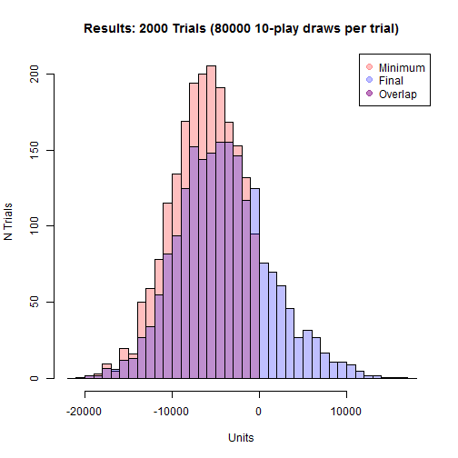

```r
mtxCum010 <- mtxSaver[storePer * (1:(nPerTrial/storePer)),]
```
  
  
###_Results for 50-play_  

```r
## Run for 50-play
baseOutcomes <- getBaseOutcomes(myFileName="Play050Outcomes.csv",forceEQ=TRUE)
```

```
## [1] "Modifying probablities 2.1776e-05 -50"
## [1] "New probablities 2.1764999999978e-05 -50"
## [1] "Probabilities sum to 1.  Outcomes has mean -0.253 and variance 5139"
```

```r
dfSummary <- calcOutcomes(baseOutcomes=baseOutcomes, nPlay=50)
```

```
## [1] "Running 50-play with nTrials=2000 nPerTrial=80000 and hurdle <=-500"
## [1] "Ouctomes across 1.6e+08 draws of 50-play have mean: -0.25 and variance: 5353"
```

```r
graphSummary(dfSummary, nPlay=50)
```

```
##     myTrial           myMax           myMin            myLast      
##  Min.   :   1.0   Min.   :  -38   Min.   :-91054   Min.   :-86299  
##  1st Qu.: 500.8   1st Qu.: 1547   1st Qu.:-37920   1st Qu.:-33754  
##  Median :1000.5   Median : 4549   Median :-27517   Median :-22024  
##  Mean   :1000.5   Mean   : 7926   Mean   :-28022   Mean   :-19973  
##  3rd Qu.:1500.2   3rd Qu.: 9138   3rd Qu.:-17441   3rd Qu.: -8924  
##  Max.   :2000.0   Max.   :91370   Max.   :   -17   Max.   : 80820  
##                                                                    
##    myCond           myN_Cond         myVal_Cond    
##  Mode :logical   Min.   :   25.0   Min.   :-542.0  
##  FALSE:5         1st Qu.:   86.0   1st Qu.:-517.0  
##  TRUE :1995      Median :  185.0   Median :-510.0  
##  NA's :0         Mean   : 1373.0   Mean   :-511.5  
##                  3rd Qu.:  582.5   3rd Qu.:-504.0  
##                  Max.   :71864.0   Max.   :-500.0  
##                  NA's   :5         NA's   :5
```


```r
mtxCum050 <- mtxSaver[storePer * (1:(nPerTrial/storePer)),]
```
  
  
###_Results for 100-play_  

```r
## Run for 100-play
baseOutcomes <- getBaseOutcomes(myFileName="Play100Outcomes.csv",forceEQ=TRUE)
```

```
## [1] "Modifying probablities 6.3e-08 -99"
## [1] "New probablities 6.48000000379104e-08 -99"
## [1] "Probabilities sum to 1.  Outcomes has mean -0.506 and variance 18791"
```

```r
dfSummary <- calcOutcomes(baseOutcomes=baseOutcomes, nPlay=100)
```

```
## [1] "Running 100-play with nTrials=2000 nPerTrial=80000 and hurdle <=-500"
## [1] "Ouctomes across 1.6e+08 draws of 100-play have mean: -0.5 and variance: 18902"
```

```r
graphSummary(dfSummary, nPlay=100)
```

```
##     myTrial           myMax            myMin             myLast       
##  Min.   :   1.0   Min.   :   -71   Min.   :-154057   Min.   :-152496  
##  1st Qu.: 500.8   1st Qu.:  2870   1st Qu.: -71840   1st Qu.: -65250  
##  Median :1000.5   Median :  7578   Median : -54180   Median : -43990  
##  Mean   :1000.5   Mean   : 14728   Mean   : -54335   Mean   : -39994  
##  3rd Qu.:1500.2   3rd Qu.: 16470   3rd Qu.: -34490   3rd Qu.: -20011  
##  Max.   :2000.0   Max.   :177797   Max.   :   -333   Max.   : 175517  
##                                                                       
##    myCond           myN_Cond         myVal_Cond    
##  Mode :logical   Min.   :    9.0   Min.   :-576.0  
##  FALSE:1         1st Qu.:   29.0   1st Qu.:-535.0  
##  TRUE :1999      Median :   61.0   Median :-521.0  
##  NA's :0         Mean   :  714.7   Mean   :-523.4  
##                  3rd Qu.:  193.5   3rd Qu.:-510.0  
##                  Max.   :68764.0   Max.   :-500.0  
##                  NA's   :1         NA's   :1
```


```r
mtxCum100 <- mtxSaver[storePer * (1:(nPerTrial/storePer)),]
```
  
  
###_Plot out cumulative quantiles_  
The cumulative data has been stored and can be analyzed.  We prepare a quantiles function and apply it to the respective cumulative outcomes files.  
  

```r
fooFake <- function(x) { quantile(x,c(0.001,0.01,0.05,0.10,0.25,0.50,0.75,0.90,0.95,0.99,1)) }
myQuants001 <- t(apply(mtxCum001, 1, FUN=fooFake))
myQuants003 <- t(apply(mtxCum003, 1, FUN=fooFake))
myQuants005 <- t(apply(mtxCum005, 1, FUN=fooFake))
myQuants010 <- t(apply(mtxCum010, 1, FUN=fooFake))
myQuants050 <- t(apply(mtxCum050, 1, FUN=fooFake))
myQuants100 <- t(apply(mtxCum100, 1, FUN=fooFake))
```
  
  
Next, we generate a function for graphing the cumulative returns of various data:  
  

```r
graphCumulative <- function(quantFile, storePer=1, nPlay, 
                            yLimit=c(-20,5), abLimit=c(0,-4,-8)
                            ) {

    keyX <- seq(storePer, nPerTrial, by=storePer)
    
    ## Plot #1 is quantiles for cumulative returns (in units) by hand
    plot(x=keyX, y=5 * quantFile[keyX/storePer , 2]/1000, col="purple", 
         type="l", lwd=2, main=paste0(nPlay, "-play results"), 
         xlab="Hand number", ylim=yLimit
         )
    
    lines(x=keyX, y=5*quantFile[keyX/storePer , 3]/1000,col="blue")
    lines(x=keyX, y=5*quantFile[keyX/storePer , 5]/1000,col="orange")
    lines(x=keyX, y=5*quantFile[keyX/storePer , 6]/1000,col="dark green")

    abline(h=abLimit, lty=2)

    abline(v=c(storePer * which(5 * quantFile[,2]/1000 <= abLimit[2])[1], 
               storePer * which(5 * quantFile[,2]/1000 <= abLimit[3])[1]
               ), col="purple", lty=2
           )

    abline(v=c(storePer * which(5 * quantFile[,5]/1000 <= abLimit[2])[1], 
               storePer * which(5 * quantFile[,5]/1000 <= abLimit[3])[1]
               ), col="orange", lty=2
           )

    legend("topright", legend=c("Median","25%","5%","1%"), lwd=3, 
           cex=0.75, col=c("dark green","orange","blue","purple")
           )

    text(x=.4*nPerTrial, y=yLimit[2], 
         paste0("Results hit 1% at: ", 
                storePer * which(5 * quantFile[,2]/1000 <= abLimit[2])[1], 
                " and ", 
                storePer * which(5 * quantFile[,2]/1000 <= abLimit[3])[1]
                ) ,cex=0.75
         )

    text(x=.4*nPerTrial, y=(yLimit[2] + .1 * (yLimit[1] - yLimit[2]) ), 
         paste0("Results hit 25% at: ", 
                storePer * which(5 * quantFile[,5]/1000 <= abLimit[2])[1], 
                " and ", 
                storePer * which(5 * quantFile[,5]/1000 <= abLimit[3])[1]
                ) ,cex=0.75
         )
    
    
    ## Plot #2 is quantiles for cumulative returns (in percentage) by # base hands
    keyXPct <- keyX * nPlay
    
    plot(x=keyX, y=quantFile[keyX/storePer , 2] / keyXPct, col="purple", 
         type="l", lwd=2, main=paste0(nPlay, "-play results"), 
         xlab="Hand number", ylim=c(-0.1,0.025)
         )
    
    lines(x=keyX, y=quantFile[keyX/storePer , 3]/keyXPct,col="blue")
    lines(x=keyX, y=quantFile[keyX/storePer , 5]/keyXPct,col="orange")
    lines(x=keyX, y=quantFile[keyX/storePer , 6]/keyXPct,col="dark green")
    
    legend("topright", legend=c("Median","25%","5%","1%"), lwd=3, 
           cex=0.75, col=c("dark green","orange","blue","purple")
           )
    
    abline(h=c(0,-0.02,-0.04), lty=2)
}
```
  
  
And, then we run the function for 1/3/5/10/50/100 play.  
  

```r
graphCumulative(quantFile=myQuants001, storePer=storePer, nPlay=1, 
                yLimit=c(-10, 2.5), abLimit=c(0,-2,-4)
                )
```


```r
graphCumulative(quantFile=myQuants003, storePer=storePer, nPlay=3, 
                yLimit=c(-20, 5), abLimit=c(0,-5,-10)
                )
```


```r
graphCumulative(quantFile=myQuants005, storePer=storePer, nPlay=5, 
                yLimit=c(-50, 12.5), abLimit=c(0,-10,-20)
                )
```

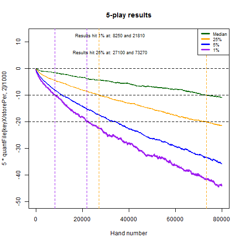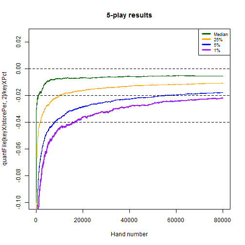

```r
graphCumulative(quantFile=myQuants010, storePer=storePer, nPlay=10, 
                yLimit=c(-100, 25), abLimit=c(0,-20,-40)
                )
```

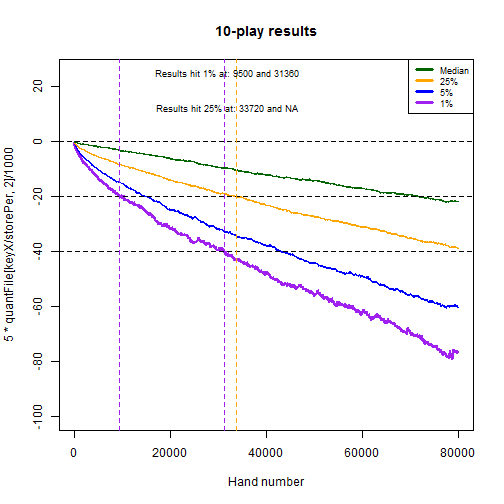

```r
graphCumulative(quantFile=myQuants050, storePer=storePer, nPlay=50, 
                yLimit=c(-500, 125), abLimit=c(0,-100,-200)
                )
```

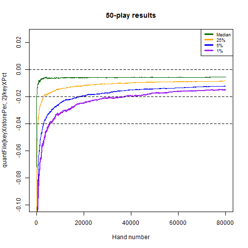

```r
graphCumulative(quantFile=myQuants100, storePer=storePer, nPlay=100, 
                yLimit=c(-1000, 250), abLimit=c(0,-200,-400)
                )
```

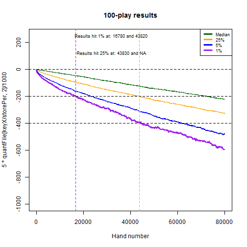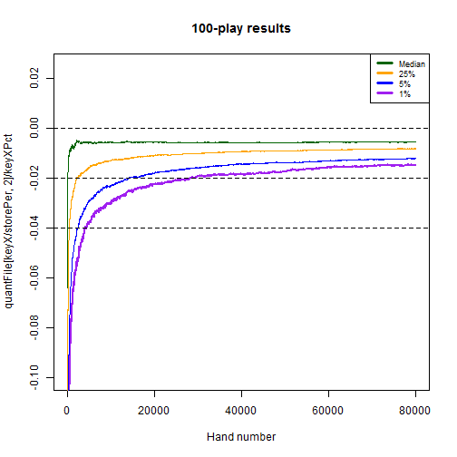
  
  
## Additional Comparisons  
Additionally, the likelihood of having various percentage results at different play lengths is calculated.


```r
for (nHands in c(100, 250, 500, 1000, 2000, 4000)) {
    keyIndex <- round(nHands / storePer, 0)
    keyHands <- keyIndex * storePer
    
    res001 <- mtxCum001[keyIndex,] / ( 1 * keyHands )
    res003 <- mtxCum003[keyIndex,] / ( 3 * keyHands )
    res005 <- mtxCum005[keyIndex,] / ( 5 * keyHands )
    res010 <- mtxCum010[keyIndex,] / ( 10 * keyHands )
    res050 <- mtxCum050[keyIndex,] / ( 50 * keyHands )
    res100 <- mtxCum100[keyIndex,] / ( 100 * keyHands )
    
    plot(x=(1:nTrials)/nTrials, y=res001[order(res001)], type="l", col="red",
         main=paste0("Results for ",keyHands," hands of base play"),
         xlab="Percentile", ylab="Percent return",ylim=c(-0.3,0.1)
         )
    
    abline(h=c(0,-0.1,-0.2),lty=2)
    
    lines(x=(1:nTrials)/nTrials, y=res003[order(res003)], col="purple")
    lines(x=(1:nTrials)/nTrials, y=res005[order(res005)], col="blue")
    ## lines(x=(1:nTrials)/nTrials, y=res010[order(res010)], col="orange")
    ## lines(x=(1:nTrials)/nTrials, y=res050[order(res050)], col="pink")
    lines(x=(1:nTrials)/nTrials, y=res100[order(res100)], col="dark green")
    
    legend("topleft",legend=c("1-play","3-play","5-play","100-play"),
           lwd=2,col=c("red","purple","blue","dark green"),cex=0.75)
}
```

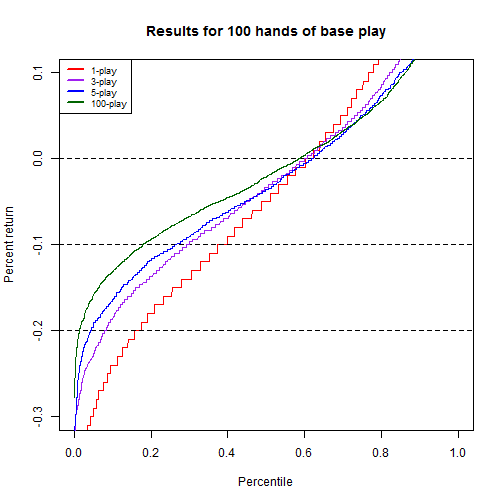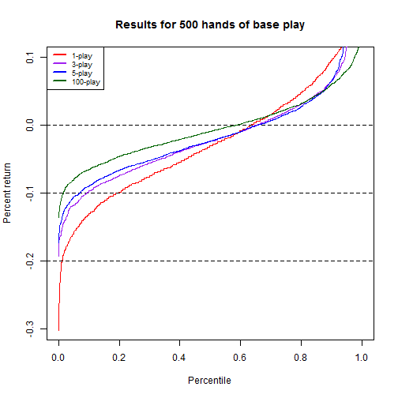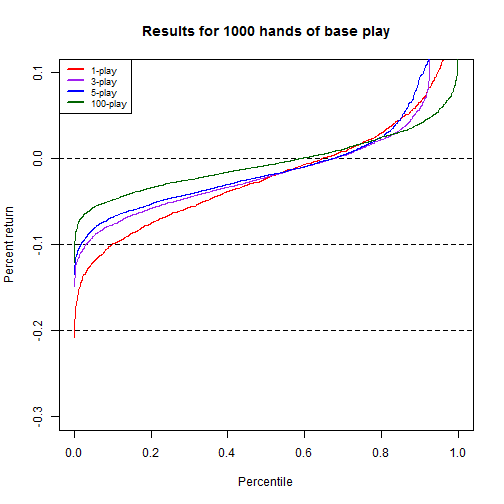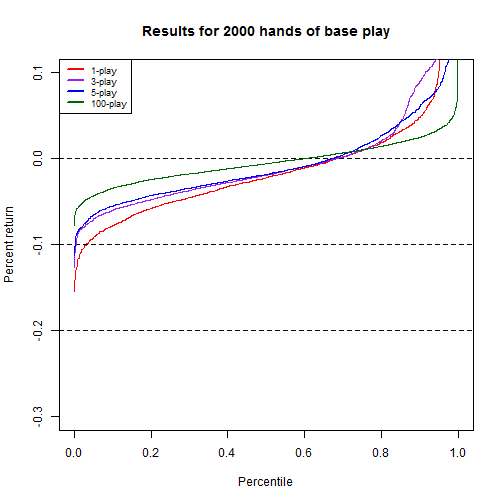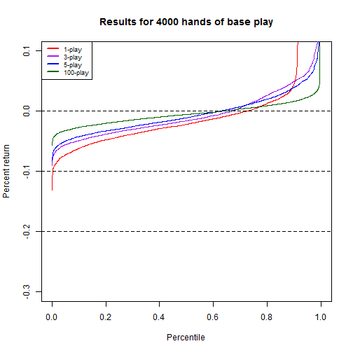
  
  
As well, the probability of being behind by more than X% plus Y$ is calculated for a few of the distributions of N-play.  
  

```r
riskRuinPctUnit <- function(frameResults, nPlay, pctStop) {
    
    frameMod <- rep(0, ncol(frameResults))
    frameTemp <- frameResults
    
    for (intCtr in 1:nrow(frameResults)) {
        frameTemp[intCtr , ] <- 5 * (frameResults[intCtr , ] + pctStop * (storePer * intCtr) * nPlay)
    }
    
    for (intCtr in 1:ncol(frameResults)) {
        frameMod[intCtr] <- min(frameTemp[ , intCtr])
    }
    
    frameMod <- frameMod[order(frameMod)]
    
    plot(x=(1:length(frameMod))/length(frameMod), y=frameMod/1000, type="l", col="purple", 
         main=paste0("Worst unit loss below ",round(100*pctStop,2),"% for ",nPlay,
                     "-play, through ",round(nPerTrial/1000,1),"k base hands"
                    ),
         xlab="Percentile", ylab=paste0("Worst unit loss (000s) below ",round(100*pctStop,2),"%")
         )
    
    abline(v=c(0.50,0.10,0.01), lty=2, col=c("dark green","blue","red"))
    keyUnits <- frameMod[round(c(0.50, 0.10, 0.01) * length(frameMod),0)]/1000
    abline(h=keyUnits, lty=2, col=c("dark green","blue","red"))

    legend("bottomright", col=c("dark green","blue","red"), lty=2, lwd=2, 
           legend=paste0(c("50% (", "10% (", "1%   ("),round(keyUnits,2),")")
           )
}
```
  
  
And then call the function a few times for a few scenarios of interest:  
  

```r
riskRuinPctUnit(frameResults=mtxCum001, nPlay=1, pctStop=0.01)  ## 1-play, 1%
```

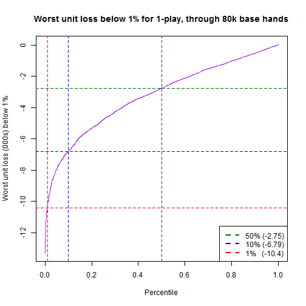

```r
riskRuinPctUnit(frameResults=mtxCum003, nPlay=3, pctStop=0.01)  ## 3-play, 1%
```


```r
riskRuinPctUnit(frameResults=mtxCum005, nPlay=5, pctStop=0.01)  ## 5-play, 1%
```


```r
riskRuinPctUnit(frameResults=mtxCum010, nPlay=10, pctStop=0.01)  ## 10-play, 1%
```


```r
riskRuinPctUnit(frameResults=mtxCum050, nPlay=50, pctStop=0.01)  ## 50-play, 1%
```

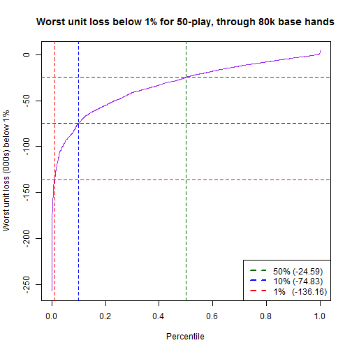

```r
riskRuinPctUnit(frameResults=mtxCum100, nPlay=100, pctStop=0.01)  ## 100-play, 1%
```

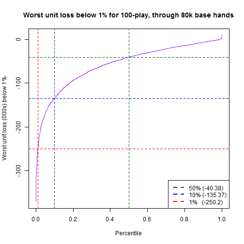

```r
riskRuinPctUnit(frameResults=mtxCum001, nPlay=1, pctStop=0.02)  ## 1-play, 2%
```

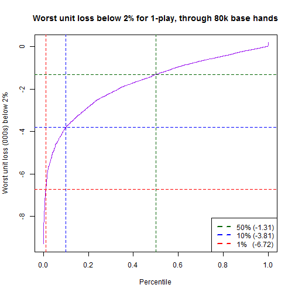

```r
riskRuinPctUnit(frameResults=mtxCum003, nPlay=3, pctStop=0.02)  ## 3-play, 2%
```

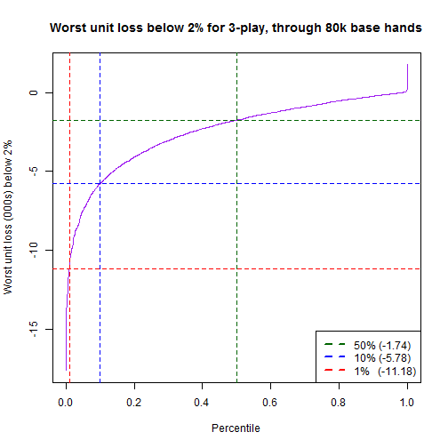

```r
riskRuinPctUnit(frameResults=mtxCum005, nPlay=5, pctStop=0.02)  ## 5-play, 2%
```


```r
riskRuinPctUnit(frameResults=mtxCum010, nPlay=10, pctStop=0.02)  ## 10-play, 2%
```


```r
riskRuinPctUnit(frameResults=mtxCum050, nPlay=50, pctStop=0.02)  ## 50-play, 2%
```


```r
riskRuinPctUnit(frameResults=mtxCum100, nPlay=100, pctStop=0.02)  ## 100-play, 2%
```


  
And then look at the histograms of results after the final hand:  


```r
keyIndex <- round(nPerTrial / storePer, 0)
keyHands <- keyIndex * storePer

## Histogram for 100 vs. 50
hist(mtxCum100[keyIndex,]/keyHands/100, col=rgb(0,0,1,0.5), 
     breaks=seq(-0.08,0.08,by=0.005), ylim=c(0,1000), 
     main=paste0("Percentage result after ",keyHands," Hands"),xlab="% Result"
     )
hist(mtxCum050[keyIndex,]/keyHands/50, col=rgb(1,0,0,0.5), add=TRUE, 
     breaks=seq(-0.08,0.08,by=0.005)
     )
legend("topright",legend=c("50-play","100-play","Overlap"),pch=20,pt.cex=2,
       col=c(rgb(1,0,0,0.5),rgb(0,0,1,0.5),rgb(0.75,0,0.75,1))
       )
```


```r
## Histogram for 50 vs. 10
hist(mtxCum050[keyIndex,]/keyHands/50, col=rgb(0,0,1,0.5), 
     breaks=seq(-0.08,0.08,by=0.005), ylim=c(0,1000), 
     main=paste0("Percentage result after ",keyHands," Hands"),xlab="% Result"
     )
hist(mtxCum010[keyIndex,]/keyHands/10, col=rgb(1,0,0,0.5), add=TRUE, 
     breaks=seq(-0.08,0.08,by=0.005)
     )
legend("topright",legend=c("10-play","50-play","Overlap"),pch=20,pt.cex=2,
       col=c(rgb(1,0,0,0.5),rgb(0,0,1,0.5),rgb(0.75,0,0.75,1))
       )
```


```r
## Histogram for 10 vs. 5
hist(mtxCum010[keyIndex,]/keyHands/10, col=rgb(0,0,1,0.5), 
     breaks=seq(-0.08,0.08,by=0.005), ylim=c(0,1000), 
     main=paste0("Percentage result after ",keyHands," Hands"),xlab="% Result"
     )
hist(mtxCum005[keyIndex,]/keyHands/5, col=rgb(1,0,0,0.5), add=TRUE, 
     breaks=seq(-0.08,0.08,by=0.005)
     )
legend("topright",legend=c("5-play","10-play","Overlap"),pch=20,pt.cex=2,
       col=c(rgb(1,0,0,0.5),rgb(0,0,1,0.5),rgb(0.75,0,0.75,1))
       )
```

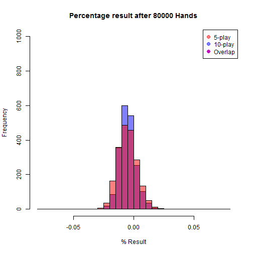

```r
## Histogram for 5 vs. 3
hist(mtxCum005[keyIndex,]/keyHands/5, col=rgb(0,0,1,0.5), 
     breaks=seq(-0.08,0.08,by=0.005), ylim=c(0,1000), 
     main=paste0("Percentage result after ",keyHands," Hands"),xlab="% Result"
     )
hist(mtxCum003[keyIndex,]/keyHands/3, col=rgb(1,0,0,0.5), add=TRUE, 
     breaks=seq(-0.08,0.08,by=0.005)
     )
legend("topright",legend=c("3-play","5-play","Overlap"),pch=20,pt.cex=2,
       col=c(rgb(1,0,0,0.5),rgb(0,0,1,0.5),rgb(0.75,0,0.75,1))
       )
```


```r
## Histogram for 3 vs. 1
hist(mtxCum003[keyIndex,]/keyHands/3, col=rgb(0,0,1,0.5), 
     breaks=seq(-0.08,0.08,by=0.005), ylim=c(0,1000), 
     main=paste0("Percentage result after ",keyHands," Hands"),xlab="% Result"
     )
hist(mtxCum001[keyIndex,]/keyHands/1, col=rgb(1,0,0,0.5), add=TRUE, 
     breaks=seq(-0.08,0.08,by=0.005)
     )
legend("topright",legend=c("1-play","3-play","Overlap"),pch=20,pt.cex=2,
       col=c(rgb(1,0,0,0.5),rgb(0,0,1,0.5),rgb(0.75,0,0.75,1))
       )
```

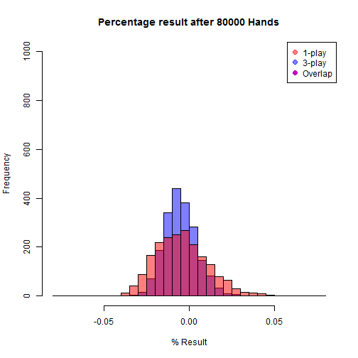

```r
## Histogram for 100 vs. 1
hist(mtxCum100[keyIndex,]/keyHands/100, col=rgb(0,0,1,0.5), 
     breaks=seq(-0.08,0.08,by=0.005), ylim=c(0,1000), 
     main=paste0("Percentage result after ",keyHands," Hands"),xlab="% Result"
     )
hist(mtxCum001[keyIndex,]/keyHands/1, col=rgb(1,0,0,0.5), add=TRUE, 
     breaks=seq(-0.08,0.08,by=0.005)
     )
legend("topright",legend=c("1-play","100-play","Overlap"),pch=20,pt.cex=2,
       col=c(rgb(1,0,0,0.5),rgb(0,0,1,0.5),rgb(0.75,0,0.75,1))
       )
```


```r
## Box plot data
frameBoxPlot <- rbind(data.frame(pctFinal=mtxCum100[keyIndex,]/keyHands/100,type="100-play"),
                      data.frame(pctFinal=mtxCum050[keyIndex,]/keyHands/50,type="50-play"),
                      data.frame(pctFinal=mtxCum010[keyIndex,]/keyHands/10,type="10-play"),
                      data.frame(pctFinal=mtxCum005[keyIndex,]/keyHands/5,type="5-play"),
                      data.frame(pctFinal=mtxCum003[keyIndex,]/keyHands/3,type="3-play"),
                      data.frame(pctFinal=mtxCum001[keyIndex,]/keyHands/1,type="1-play")
                      )

boxplot(pctFinal ~ type, data=frameBoxPlot, col="light blue", ylab="% Return", 
        main=paste0("Percentage Outcomes after ",keyHands," Hands")
        )
```


  
Upon inspection, the histograms reasonably resemble normal distributions, as could be expected under the CLT with such a large number of hands.  Further, the following trends are noted:  
  
* The 100-play and 1-play histograms look very different, with much smaller sigma for 100-play  
* Overlapped histograms of 1 click difference in N-play tend to reasonably resemble one another, although with somewhat larger differences for 50 -> 10 and for 3 -> 1  
* The box-plots reveal that the primary outliers are on the positive side.  In other words, the mean is achieved through a slightly lower median pulled up by a few positive outliers  
  
We can then look at a few distributional tendencies through statistics:  


```r
meansFinal <- tapply(frameBoxPlot$pctFinal, frameBoxPlot$type, FUN=mean)
mediansFinal <- tapply(frameBoxPlot$pctFinal, frameBoxPlot$type, FUN=median)
sdFinal <- tapply(frameBoxPlot$pctFinal, frameBoxPlot$type, FUN=sd)

pct01Final <- tapply(frameBoxPlot$pctFinal, frameBoxPlot$type, 
                     FUN=function(x) { quantile(x, 0.01) } 
                     )
pct99Final <- tapply(frameBoxPlot$pctFinal, frameBoxPlot$type, 
                     FUN=function(x) { quantile(x, 0.99) } 
                     )

round(meansFinal,4)
```

```
## 100-play  50-play  10-play   5-play   3-play   1-play 
##  -0.0050  -0.0050  -0.0051  -0.0052  -0.0051  -0.0045
```

```r
round(mediansFinal,4)
```

```
## 100-play  50-play  10-play   5-play   3-play   1-play 
##  -0.0055  -0.0055  -0.0054  -0.0054  -0.0056  -0.0055
```

```r
round(sdFinal,4)
```

```
## 100-play  50-play  10-play   5-play   3-play   1-play 
##   0.0049   0.0051   0.0066   0.0080   0.0095   0.0152
```

```r
round(pct01Final,4)
```

```
## 100-play  50-play  10-play   5-play   3-play   1-play 
##  -0.0149  -0.0150  -0.0191  -0.0218  -0.0248  -0.0339
```

```r
round(pct99Final,4)
```

```
## 100-play  50-play  10-play   5-play   3-play   1-play 
##   0.0098   0.0102   0.0126   0.0149   0.0191   0.0364
```

```r
plot(x=meansFinal, type="l", col="blue", lwd=2, ylim=c(-0.04,0.04), 
     ylab="% Return", xaxt="n", xlab="",main=paste0("Percentage Return at ",keyHands," Hands")
     )
axis(1,at=1:6,labels=attr(meansFinal,"dimname")[[1]])
lines(mediansFinal,col="purple",lwd=2)
lines(meansFinal+sdFinal,col="dark green",lty=2,lwd=2)
lines(meansFinal-sdFinal,col="dark green",lty=2,lwd=2)
lines(pct99Final,col="orange",lty=2,lwd=2)
lines(pct01Final,col="orange",lty=2,lwd=2)
abline(h=c(0,-0.0046,-0.02,-0.04),lwd=0.5,lty=2)
legend("topleft", legend=c("99%/1%","Mean +/- 1SD","Median","Mean"), cex=0.85, 
       lwd=2, lty=c(2,2,1,1), col=c("orange","dark green","purple","blue")
       )
```

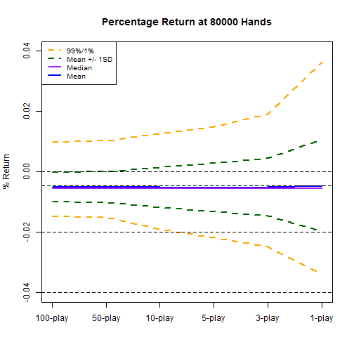

