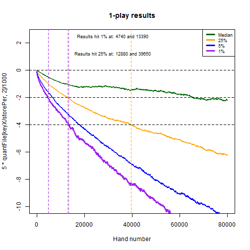

## Overview and Synopsis  
This routine analyzes variability of N-play video poker results based on simulation data made available by the Wizard of Odds <http://wizardofodds.com/games/video-poker/appendix/2/>.  The game simulated was 9/6 Jacks or Better, and this routine looks at the impact of playing 5,000 hands with 1/3/5/10/50/100 lines per hand.  The code broadly copies routines from Exercise002_v003.R, but with the intent of storing figures and summaries.
  
## Data Processing  
###_Coding Routine_  
The Wizard of Odds file was pre-processed in Excel and saved as a CSV once per each of the desired N-play outcomes.  The file is read in, parsed to eliminate any unwanted values, and then assessed based on random draws from uniform(0,1).  Results are stored for the final outcome and the minimum cumulative outcomes.  

Below is the routine for creating the data.  It has been converted to a function so it can be re-run multiple times.  

First, a function is created to read and process files for mapping probabilities to outcomes.  

```r
getBaseOutcomes <- function(myFileName="BaseOutcomes.csv", myDelete=NULL, forceEQ=FALSE) {
    
    if (file.exists(myFileName)) {
        baseOutcomes <- read.csv(myFileName,stringsAsFactors = FALSE)
        if (ncol(baseOutcomes) != 2) { stop("Error in CSV file, should have exactly 2 columns") }
        colnames(baseOutcomes) <- c("probs","outcomes")
    } else {
        baseOutcomes <- data.frame(probs=c(0.01,0.02,0.05,0.18,0.24,0.50),outcomes=c(10,5,2,1,0,-1))
    }
    
    baseOutcomes <- baseOutcomes[baseOutcomes$probs != 0,] ## Can have zeroes as inputs -- ignore those
    
    if ( forceEQ ) {
        pDelta <- sum(baseOutcomes$probs) - 1
        if ( abs(pDelta) < 0.0000001 & 
             abs(pDelta) / baseOutcomes[nrow(baseOutcomes),]$probs < 0.1
            ) 
        {
            print(paste0("Modifying probablities ",paste0(baseOutcomes[nrow(baseOutcomes),],collapse=" ")))
            baseOutcomes[nrow(baseOutcomes),]$probs <- baseOutcomes[nrow(baseOutcomes),]$probs - pDelta
            print(paste0("New probablities ",paste0(baseOutcomes[nrow(baseOutcomes),],collapse=" ")))
        }
    }
    
    if (sum(baseOutcomes$probs)!=1 | min(baseOutcomes$probs) < 0 | 
        sum(is.na(baseOutcomes$probs)) > 0 | sum(is.na(baseOutcomes$outcomes)) > 0) { 
        stop("Please resolve the issue with inputs for probs and outcomes, aborting") 
    }
    
    ## Store the original value read in as outcomes
    baseOutcomes$oldOutcomes <- baseOutcomes$outcomes
    
    ## Null the baseOutcomes$outcomes where outcomes >= X
    if (!is.null(myDelete)) {
        myCond <- parse(text=paste0("baseOutcomes$outcomes",myDelete))
        baseOutcomes$outcomes[eval(myCond)] <- 0
        print(paste0("Converted all cases where ",myCond," to baseOutcomes$outcomes = 0"))
    }
    
    baseMean <- sum(baseOutcomes$probs*baseOutcomes$outcomes)
    baseVar <- sum(baseOutcomes$probs*(baseOutcomes$outcomes-baseMean)^2)
    
    print(paste0("Probabilities sum to 1.  Outcomes has mean ",format(baseMean,digits=3),
                 " and variance ",format(baseVar,digits=3)))

    return(baseOutcomes)
}
```
  
Second, a function is created to draw the random variables and calculate the outcomes database.  

```r
calcOutcomes <- function(baseOutcomes=baseOutcomes,nPlay=1) {
    
    ## Allow nTrials, nPerTrial, and myHurdle to come from global environment
    print(paste0("Running ",nPlay,"-play with nTrials=",nTrials,
                 " nPerTrial=",nPerTrial," and hurdle ",myHurdle
                 )
          )
    
    myCDF <- numeric(nrow(baseOutcomes)+1)
    myCDF[1] <- 0

    for ( intCtr in 1:nrow(baseOutcomes) ) {
        myCDF[intCtr+1] <- myCDF[intCtr] + baseOutcomes$probs[intCtr]
    }

    mtxCumOutcomes <- matrix(baseOutcomes$outcomes[findInterval(matrix(data=runif(nTrials*nPerTrial,0,1),
                                                                       nrow=nPerTrial,
                                                                       ncol=nTrials
                                                                       ),
                                                                myCDF,rightmost.closed=TRUE
                                                                )
                                               ],
                         nrow=nPerTrial,
                         ncol=nTrials
                         )

    print(paste0("Ouctomes across ",nTrials*nPerTrial," draws of ",nPlay,"-play have mean: ",
                 format(mean(mtxCumOutcomes),digits=3)," and variance: ",
                 format(sd(mtxCumOutcomes)^2,digits=3)
                 )
         )

    mtxCumOutcomes <- apply(mtxCumOutcomes,2,FUN=cumsum)  ## About 2.5 seconds for 12,000 x 5,000

    ## Pop this back outside the function for further analysis
    mtxSaver <<- mtxCumOutcomes
    
    maxPerTrial <- apply(mtxCumOutcomes,2,FUN=max)  ## About 1.0 seconds for 12,000 x 5,000
    minPerTrial <- apply(mtxCumOutcomes,2,FUN=min)  ## About 1.0 seconds for 12,000 x 5,000
    lastPerTrial <- as.numeric(mtxCumOutcomes[nrow(mtxCumOutcomes),])
    dfSummary <- data.frame(myTrial = 1:nTrials, myMax = maxPerTrial, myMin = minPerTrial, 
                            myLast = lastPerTrial, myCond = FALSE, myN_Cond = NA, myVal_Cond = NA
                            )
    dfSummary$myCond <- eval(parse(text=paste0("dfSummary$myMin",myHurdle)))
    
    foo <- function(x) { 
        which(eval(parse(text=paste0("x",myHurdle))))[1]
    }
    
    dfSummary$myN_Cond <- apply(mtxCumOutcomes,2,FUN=foo)  ## About 2.5 seconds for 12,000 x 5,000
    
    for ( intCtr in 1:nTrials ) {
        dfSummary$myVal_Cond[intCtr] <- mtxCumOutcomes[dfSummary$myN_Cond[intCtr],dfSummary$myTrial[intCtr]]
    }
    
    return(dfSummary)
}
```

Additionally, a function is created to graph the data and store the outputs.  

```r
graphSummary <- function(graphData, nPlay=1) {
    
    graphData <- graphData[order(-graphData$myCond, graphData$myN_Cond, -graphData$myLast),]
    print(summary(graphData))

    ## Have the x and y units auto-calculated
    minX <- min(graphData$myMin)                  ## Find most negative element
    maxX <- max(0, graphData$myLast)              ## Find most positive element (use 0 if all are negative)
    powX <- log10(max(1, abs(minX), abs(maxX)))   ## Find rough "power" of data

    unitX <- 10^(round(powX-0.5,0)-1)             ## If thousands, use hundreds; if hundreds, use tens; etc.
    minX <- unitX*(floor(minX/unitX)-1)           ## Round to similar units as unitX
    maxX <- unitX*(ceiling(maxX/unitX)+1)         ## Round to similar units as unitX

    hist(graphData$myMin,
         col=rgb(1,0,0,.25),
         main=paste0("Results: ",nTrials," Trials (",nPerTrial," ",
                     nPlay,"-play draws per trial)"
                     ), 
         xlab="Units", ylab="N Trials",
         breaks=seq(minX,maxX,by=unitX),
         xlim=c(minX, maxX)
         )

    hist(graphData$myLast,col=rgb(0,0,1,.25),
         breaks=seq(minX,maxX,by=unitX),
         xlim=c(minX,maxX),
         add=TRUE
         )

    legend("topright",col=c(rgb(1,0,0,.25),rgb(0,0,1,.25),rgb(0.5,0,0.5,.5)),
           legend=c("Minimum","Final","Overlap"),pch=20,pt.cex=2
           )

}
```

###_Prepare the global parameters_  
Finally, the key global parameters are set.  


```r
nTrials <- 2000
nPerTrial <- 50000
myHurdle <- "<=-500"
```
  
  
## Results  
The simulation is repeated for each of the desired N-play outcomes.  In this case, we have run the routine for 1/3/5/10/50/100 play.  
  

###_Results for 1-play_  

```r
## Run for 1-play
baseOutcomes <- getBaseOutcomes(myFileName="Play001Outcomes.csv",forceEQ=TRUE)
```

```
## [1] "Modifying probablities 0.54543467 -1"
## [1] "New probablities 0.54543466 -1"
## [1] "Probabilities sum to 1.  Outcomes has mean -0.00456 and variance 19.5"
```

```r
dfSummary <- calcOutcomes(baseOutcomes=baseOutcomes, nPlay=1)
```

```
## [1] "Running 1-play with nTrials=2000 nPerTrial=50000 and hurdle <=-500"
## [1] "Ouctomes across 1e+08 draws of 1-play have mean: -0.00459 and variance: 19.5"
```

```r
graphSummary(dfSummary, nPlay=1)
```

```
##     myTrial           myMax            myMin             myLast       
##  Min.   :   1.0   Min.   :  -1.0   Min.   :-2409.0   Min.   :-2356.0  
##  1st Qu.: 500.8   1st Qu.:  69.0   1st Qu.:-1200.2   1st Qu.: -961.0  
##  Median :1000.5   Median : 373.0   Median : -789.0   Median : -335.5  
##  Mean   :1000.5   Mean   : 599.3   Mean   : -832.7   Mean   : -229.7  
##  3rd Qu.:1500.2   3rd Qu.: 936.2   3rd Qu.: -389.0   3rd Qu.:  413.5  
##  Max.   :2000.0   Max.   :5149.0   Max.   :   -2.0   Max.   : 4312.0  
##                                                                       
##    myCond           myN_Cond       myVal_Cond  
##  Mode :logical   Min.   : 3635   Min.   :-500  
##  FALSE:639       1st Qu.:11863   1st Qu.:-500  
##  TRUE :1361      Median :16836   Median :-500  
##  NA's :0         Mean   :19577   Mean   :-500  
##                  3rd Qu.:24711   3rd Qu.:-500  
##                  Max.   :49755   Max.   :-500  
##                  NA's   :639     NA's   :639
```


```r
mtxCum001 <- mtxSaver
```
  
    
###_Results for 3-play_  

```r
## Run for 3-play
baseOutcomes <- getBaseOutcomes(myFileName="Play003Outcomes.csv",forceEQ=TRUE)
```

```
## [1] "Modifying probablities 0.262602735 -3"
## [1] "New probablities 0.26260273 -3"
## [1] "Probabilities sum to 1.  Outcomes has mean -0.0152 and variance 67.7"
```

```r
dfSummary <- calcOutcomes(baseOutcomes=baseOutcomes, nPlay=3)
```

```
## [1] "Running 3-play with nTrials=2000 nPerTrial=50000 and hurdle <=-500"
## [1] "Ouctomes across 1e+08 draws of 3-play have mean: -0.015 and variance: 68.1"
```

```r
graphSummary(dfSummary, nPlay=3)
```

```
##     myTrial           myMax            myMin             myLast       
##  Min.   :   1.0   Min.   :  -3.0   Min.   :-5716.0   Min.   :-5656.0  
##  1st Qu.: 500.8   1st Qu.: 170.5   1st Qu.:-2542.2   1st Qu.:-2083.5  
##  Median :1000.5   Median : 755.5   Median :-1693.0   Median : -864.0  
##  Mean   :1000.5   Mean   :1078.7   Mean   :-1801.9   Mean   : -748.8  
##  3rd Qu.:1500.2   3rd Qu.:1584.2   3rd Qu.: -911.2   3rd Qu.:  433.2  
##  Max.   :2000.0   Max.   :7144.0   Max.   :    6.0   Max.   : 6859.0  
##                                                                       
##    myCond           myN_Cond       myVal_Cond    
##  Mode :logical   Min.   : 1155   Min.   :-502.0  
##  FALSE:264       1st Qu.: 3794   1st Qu.:-501.0  
##  TRUE :1736      Median : 6228   Median :-501.0  
##  NA's :0         Mean   :10695   Mean   :-500.7  
##                  3rd Qu.:13952   3rd Qu.:-500.0  
##                  Max.   :49763   Max.   :-500.0  
##                  NA's   :264     NA's   :264
```


```r
mtxCum003 <- mtxSaver
```
  
  
###_Results for 5-play_  

```r
## Run for 5-play
baseOutcomes <- getBaseOutcomes(myFileName="Play005Outcomes.csv",forceEQ=TRUE)
```

```
## [1] "Modifying probablities 0.130120405 -5"
## [1] "New probablities 0.130120414 -5"
## [1] "Probabilities sum to 1.  Outcomes has mean -0.0253 and variance 130"
```

```r
dfSummary <- calcOutcomes(baseOutcomes=baseOutcomes, nPlay=5)
```

```
## [1] "Running 5-play with nTrials=2000 nPerTrial=50000 and hurdle <=-500"
## [1] "Ouctomes across 1e+08 draws of 5-play have mean: -0.0273 and variance: 131"
```

```r
graphSummary(dfSummary, nPlay=5)
```

```
##     myTrial           myMax           myMin           myLast       
##  Min.   :   1.0   Min.   :   -5   Min.   :-8509   Min.   :-8143.0  
##  1st Qu.: 500.8   1st Qu.:  219   1st Qu.:-3892   1st Qu.:-3133.0  
##  Median :1000.5   Median :  897   Median :-2570   Median :-1502.0  
##  Mean   :1000.5   Mean   : 1372   Mean   :-2724   Mean   :-1366.4  
##  3rd Qu.:1500.2   3rd Qu.: 1988   3rd Qu.:-1404   3rd Qu.:  272.2  
##  Max.   :2000.0   Max.   :10511   Max.   :   -3   Max.   : 9225.0  
##                                                                    
##    myCond           myN_Cond       myVal_Cond    
##  Mode :logical   Min.   :  585   Min.   :-504.0  
##  FALSE:181       1st Qu.: 2152   1st Qu.:-502.0  
##  TRUE :1819      Median : 3695   Median :-501.0  
##  NA's :0         Mean   : 7058   Mean   :-501.2  
##                  3rd Qu.: 8015   3rd Qu.:-500.0  
##                  Max.   :49939   Max.   :-500.0  
##                  NA's   :181     NA's   :181
```


  
  
###_Results for 10-play_  

```r
## Run for 10-play
baseOutcomes <- getBaseOutcomes(myFileName="Play010Outcomes.csv",forceEQ=TRUE)
```

```
## [1] "Modifying probablities 0.025913774 -10"
## [1] "New probablities 0.025913775 -10"
## [1] "Probabilities sum to 1.  Outcomes has mean -0.0506 and variance 345"
```

```r
dfSummary <- calcOutcomes(baseOutcomes=baseOutcomes, nPlay=10)
```

```
## [1] "Running 10-play with nTrials=2000 nPerTrial=50000 and hurdle <=-500"
## [1] "Ouctomes across 1e+08 draws of 10-play have mean: -0.0477 and variance: 352"
```

```r
graphSummary(dfSummary, nPlay=10)
```

```
##     myTrial           myMax           myMin            myLast      
##  Min.   :   1.0   Min.   :   -8   Min.   :-14124   Min.   :-13427  
##  1st Qu.: 500.8   1st Qu.:  461   1st Qu.: -6336   1st Qu.: -5291  
##  Median :1000.5   Median : 1426   Median : -4334   Median : -2717  
##  Mean   :1000.5   Mean   : 2150   Mean   : -4546   Mean   : -2387  
##  3rd Qu.:1500.2   3rd Qu.: 2922   3rd Qu.: -2386   3rd Qu.:   279  
##  Max.   :2000.0   Max.   :14926   Max.   :    -3   Max.   : 13193  
##                                                                    
##    myCond           myN_Cond         myVal_Cond    
##  Mode :logical   Min.   :  234.0   Min.   :-509.0  
##  FALSE:93        1st Qu.:  891.5   1st Qu.:-504.0  
##  TRUE :1907      Median : 1721.0   Median :-502.0  
##  NA's :0         Mean   : 4661.8   Mean   :-502.5  
##                  3rd Qu.: 4248.0   3rd Qu.:-501.0  
##                  Max.   :49555.0   Max.   :-500.0  
##                  NA's   :93        NA's   :93
```


  
  
###_Results for 50-play_  

```r
## Run for 50-play
baseOutcomes <- getBaseOutcomes(myFileName="Play050Outcomes.csv",forceEQ=TRUE)
```

```
## [1] "Modifying probablities 2.1776e-05 -50"
## [1] "New probablities 2.1764999999978e-05 -50"
## [1] "Probabilities sum to 1.  Outcomes has mean -0.253 and variance 5139"
```

```r
dfSummary <- calcOutcomes(baseOutcomes=baseOutcomes, nPlay=50)
```

```
## [1] "Running 50-play with nTrials=2000 nPerTrial=50000 and hurdle <=-500"
## [1] "Ouctomes across 1e+08 draws of 50-play have mean: -0.253 and variance: 5379"
```

```r
graphSummary(dfSummary, nPlay=50)
```

```
##     myTrial           myMax           myMin            myLast      
##  Min.   :   1.0   Min.   :  -34   Min.   :-61608   Min.   :-61369  
##  1st Qu.: 500.8   1st Qu.: 1423   1st Qu.:-26833   1st Qu.:-23334  
##  Median :1000.5   Median : 3857   Median :-18819   Median :-14084  
##  Mean   :1000.5   Mean   : 7040   Mean   :-19501   Mean   :-12646  
##  3rd Qu.:1500.2   3rd Qu.: 8129   3rd Qu.:-11038   3rd Qu.: -4408  
##  Max.   :2000.0   Max.   :94666   Max.   :    -4   Max.   : 91588  
##                                                                    
##    myCond           myN_Cond       myVal_Cond    
##  Mode :logical   Min.   :   23   Min.   :-541.0  
##  FALSE:19        1st Qu.:   82   1st Qu.:-517.0  
##  TRUE :1981      Median :  174   Median :-510.0  
##  NA's :0         Mean   : 1350   Mean   :-511.5  
##                  3rd Qu.:  576   3rd Qu.:-505.0  
##                  Max.   :45161   Max.   :-500.0  
##                  NA's   :19      NA's   :19
```


  
  
###_Results for 100-play_  

```r
## Run for 100-play
baseOutcomes <- getBaseOutcomes(myFileName="Play100Outcomes.csv",forceEQ=TRUE)
```

```
## [1] "Modifying probablities 6.3e-08 -99"
## [1] "New probablities 6.48000000379104e-08 -99"
## [1] "Probabilities sum to 1.  Outcomes has mean -0.506 and variance 18791"
```

```r
dfSummary <- calcOutcomes(baseOutcomes=baseOutcomes, nPlay=100)
```

```
## [1] "Running 100-play with nTrials=2000 nPerTrial=50000 and hurdle <=-500"
## [1] "Ouctomes across 1e+08 draws of 100-play have mean: -0.513 and variance: 18459"
```

```r
graphSummary(dfSummary, nPlay=100)
```

```
##     myTrial           myMax            myMin             myLast       
##  Min.   :   1.0   Min.   :   -71   Min.   :-117540   Min.   :-115395  
##  1st Qu.: 500.8   1st Qu.:  2520   1st Qu.: -51881   1st Qu.: -46138  
##  Median :1000.5   Median :  6678   Median : -36828   Median : -28018  
##  Mean   :1000.5   Mean   : 12471   Mean   : -37959   Mean   : -25656  
##  3rd Qu.:1500.2   3rd Qu.: 14276   3rd Qu.: -21784   3rd Qu.: -10405  
##  Max.   :2000.0   Max.   :168959   Max.   :    -19   Max.   : 160958  
##                                                                       
##    myCond           myN_Cond         myVal_Cond    
##  Mode :logical   Min.   :   10.0   Min.   :-568.0  
##  FALSE:8         1st Qu.:   28.0   1st Qu.:-535.0  
##  TRUE :1992      Median :   62.0   Median :-520.0  
##  NA's :0         Mean   :  692.6   Mean   :-522.9  
##                  3rd Qu.:  194.0   3rd Qu.:-509.0  
##                  Max.   :48770.0   Max.   :-500.0  
##                  NA's   :8         NA's   :8
```


  
  
###_Plot out cumulative quantiles for 1-play and 3-play_  
The cumulative data for 1-play has been stored and can be analyzed.  We prepare a quantiles function and apply it to the respective cumulative outcomes files.  
  

```r
fooFake <- function(x) { quantile(x,c(0.001,0.01,0.05,0.10,0.25,0.50,0.75,0.90,0.95,0.99,1)) }
myQuants001 <- t(apply(mtxCum001, 1, FUN=fooFake))
myQuants003 <- t(apply(mtxCum003, 1, FUN=fooFake))
```

Next, we can plot the cumulative results for the 1-play data.  
  
  

```r
plot(x=1:50000, y=5*myQuants001[1:50000 , 2]/1000, col="purple", 
     type="l", lwd=2, main="1-play results", xlab="Hand number",
     ylim=c(-20,5)
     )
lines(x=1:50000,y=5*myQuants001[1:50000 , 3]/1000,col="blue")
lines(x=1:50000,y=5*myQuants001[1:50000 , 5]/1000,col="orange")
lines(x=1:50000,y=5*myQuants001[1:50000 , 6]/1000,col="dark green")

abline(h=c(0,-4,-8),lty=2)

abline(v=c(which(5*myQuants001[,2]/1000 <= -4)[1], 
           which(5*myQuants001[,2]/1000 <= -8)[1]
           ), col="purple", lty=2
       )

abline(v=c(which(5*myQuants001[,5]/1000 <= -4)[1], 
           which(5*myQuants001[,5]/1000 <= -8)[1]
           ), col="orange", lty=2
       )

legend("topright", legend=c("Median","25%","5%","1%"), lwd=3, 
       cex=0.75, col=c("dark green","orange","blue","purple")
       )

text(x=20000, y=5, paste0("Results hit 1% at: ", which(5*myQuants001[,2]/1000 <= -4)[1],
                          " and ", which(5*myQuants001[,2]/1000 <= -8)[1]
                          ) ,cex=0.75
     )

text(x=20000, y=3, paste0("Results hit 25% at: ", which(5*myQuants001[,5]/1000 <= -4)[1],
                          " and ", which(5*myQuants001[,5]/1000 <= -8)[1]
                          ) ,cex=0.75
     )
```


  
  
We can also plot the cumulative results for the 3-play data.  
  

```r
plot(x=1:50000, y=5*myQuants003[1:50000 , 2]/1000, col="purple", 
     type="l", lwd=2, main="3-play results", xlab="Hand number",
     ylim=c(-20,5)
     )
lines(x=1:50000,y=5*myQuants003[1:50000 , 3]/1000,col="blue")
lines(x=1:50000,y=5*myQuants003[1:50000 , 5]/1000,col="orange")
lines(x=1:50000,y=5*myQuants003[1:50000 , 6]/1000,col="dark green")

abline(h=c(0,-4,-8),lty=2)

abline(v=c(which(5*myQuants003[,2]/1000 <= -4)[1], 
           which(5*myQuants003[,2]/1000 <= -8)[1]
           ), col="purple", lty=2
       )

abline(v=c(which(5*myQuants003[,5]/1000 <= -4)[1], 
           which(5*myQuants003[,5]/1000 <= -8)[1]
           ), col="orange", lty=2
       )

legend("topright", legend=c("Median","25%","5%","1%"), lwd=3, 
       cex=0.75, col=c("dark green","orange","blue","purple")
       )

text(x=20000, y=5, paste0("Results hit 1% at: ", which(5*myQuants003[,2]/1000 <= -4)[1],
                          " and ", which(5*myQuants003[,2]/1000 <= -8)[1]
                          ) ,cex=0.75
     )

text(x=20000, y=3, paste0("Results hit 25% at: ", which(5*myQuants003[,5]/1000 <= -4)[1],
                          " and ", which(5*myQuants003[,5]/1000 <= -8)[1]
                          ) ,cex=0.75
     )
```



